# SMART RMS
### Smart University RMS Resolution & Operations System

> **AI-assisted RMS resolution and operations platform for universities using NLP, RAG, privacy-aware processing, and human-in-the-loop workflows.**

[](LICENSE)
[](https://fastapi.tiangolo.com)
[](https://react.dev)
[](docs/architecture/ai-pipeline.md)
[](docs/architecture/privacy-security.md)

---

## 📌 Executive Summary

### The Real Problem
University departments (such as Academics, Examination, Hostel Affairs, Accounts, and Student Welfare) receive hundreds of student **RMS (Relationship Management System / Grievance)** tickets daily. 

The primary operational bottleneck is **not** how tickets are submitted—it is the heavy cognitive burden placed on administrative staff who must manually:
1. Read through unstructured student descriptions, emotional complaints, and queries.
2. Deduce intent, correct department, and true urgency.
3. Cross-check authoritative university policies, circulars, and SOPs.
4. Manually draft repetitive, policy-compliant responses.
5. Coordinate inter-departmental transfers and escalations.

This manual process leads to staff burnout, response latency, inconsistent information, and SLA breaches.

### The Solution: Smart RMS Copilot
**Smart RMS** acts as an intelligent **AI Copilot** for university administrative staff. Rather than an autonomous bot making high-stakes decisions, Smart RMS performs automated intake triage, masks sensitive personal identifiers (PII), retrieves verified university policies using Retrieval-Augmented Generation (RAG), and presents staff with a **grounded response draft with clear source citations**.

Staff can review, edit, approve, redirect, or escalate tickets in seconds with complete confidence and audit traceability.

> 🛡️ **Core Product Principle:**  
> **AI assists. Humans decide.**  
> *Smart RMS does not make autonomous, irreversible university decisions. We reject "0 hallucinations" claims and instead enforce strict source attribution, confidence scoring, uncertainty handling, human-in-the-loop sign-off, and policy constraints.*

---

## 🚀 Key Features

- **Automated RMS Ingestion & Triage:** Ingests tickets and detects intent, category, department routing, and priority using NLP.
- **Privacy & PII Protection:** Automatically detects and redacts phone numbers, registration numbers, emails, and personal IDs before LLM processing.
- **Grounded Policy RAG:** Retrieves clauses exclusively from approved university policies, circulars, and handbooks (Chroma vector store / semantic search).
- **Evidence-Backed Response Drafts:** Generates draft responses with inline citations, quotes, and links to source documents.
- **Staff Copilot Dashboard:** A high-productivity workstation for triage staff featuring queue filters, priority badges, draft editing, and one-click approvals.
- **Human-in-the-Loop Actions:** Staff can edit drafts, approve & send, escalate to Department HODs, or re-route tickets.
- **Audit & Analytics:** Tracks the entire lifecycle of each ticket, measuring AI accuracy, staff acceptance rate, and department workload.
- **Pluggable Integration Architecture:** Clean adapter layer ready for university systems (LPU UMS/RMS, ERP, LMS) using mock adapters for development.

---

## 🏛️ High-Level System Architecture

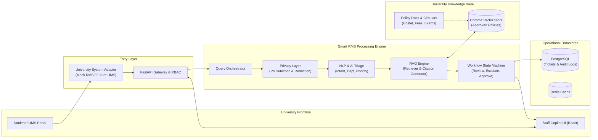

---

## 🎬 Visual Tour & Demonstration Gallery

> Experience the interactive Smart RMS Staff Copilot Workstation, automated triage pipeline, RAG policy citations, and analytics dashboard.

### 📽️ Interactive Copilot Workflow Demo
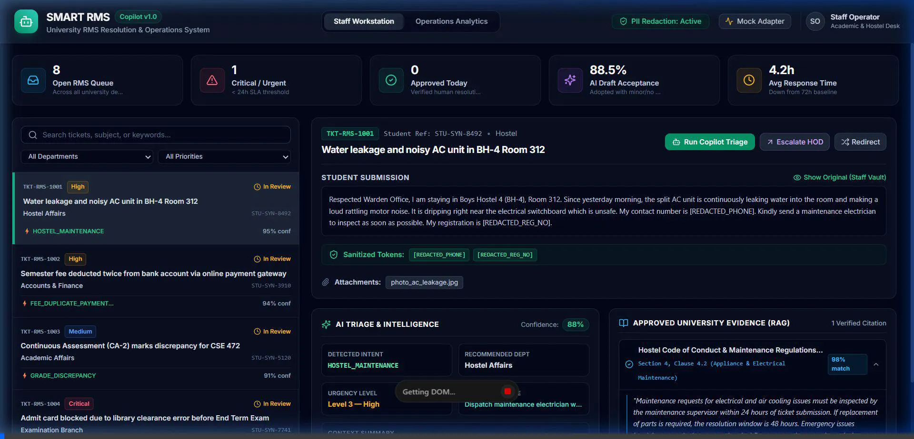

---

### 1. Staff Workstation Overview
The frontline administrative dashboard featuring real-time queue metrics, priority filters, multi-department queue, and PII protection status.
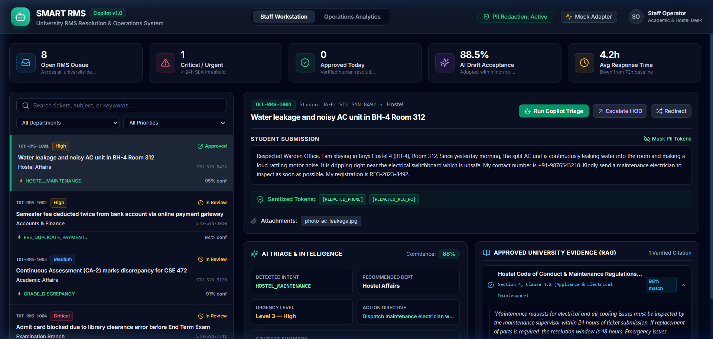

---

### 2. Automated AI Triage (Hostel Maintenance & Water Leakage)
Incoming ticket with automatic intent detection (`HOSTEL_MAINTENANCE`), recommended department routing, urgency calculation (Level 3 - High), and sanitized student identifiers.
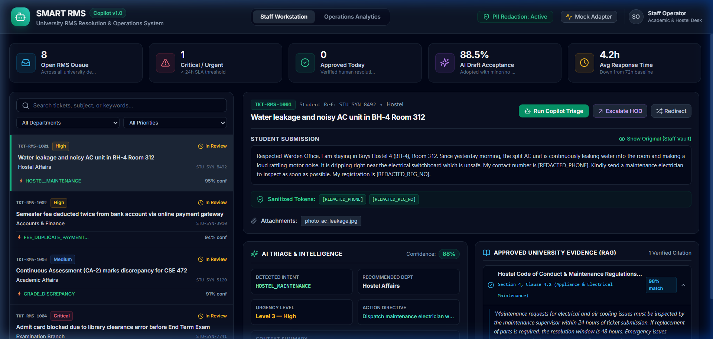

---

### 3. Financial Grievance Triage (Duplicate Semester Fee Refund)
Student reported dual tuition debit. The AI pipeline extracts transaction amounts, bank gateway entities, and initiates the reconciliation workflow.
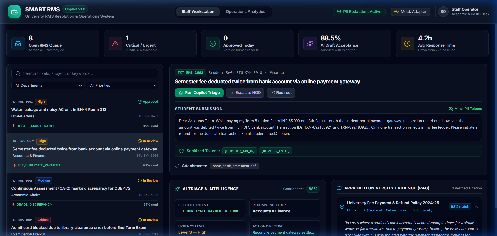

---

### 4. Grounded Policy Citations (RAG Evidence Verification)
Smart RMS retrieves the exact clause from official university regulations (*Fee Payment & Refund Policy Clause 8.3*), citing the 7-10 day settlement window.
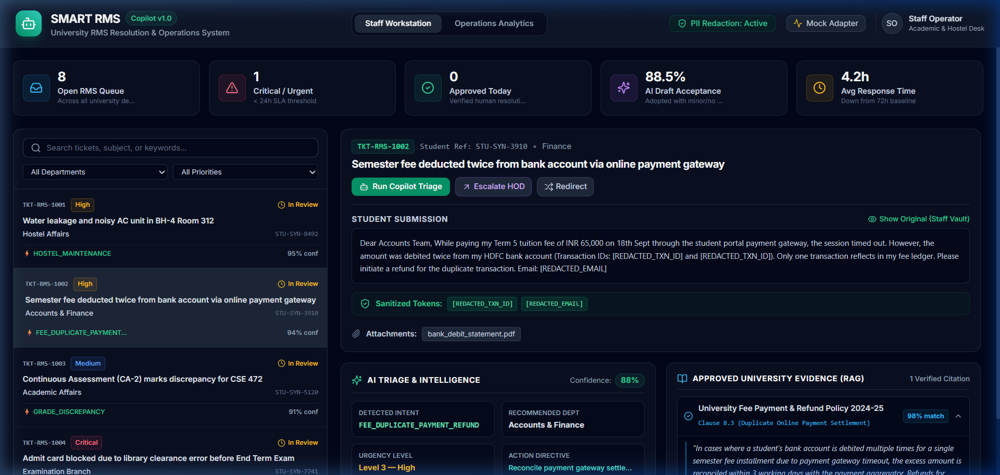

---

### 5. Critical Priority Escalation (Admit Card Clearance Hold)
Examination hall ticket blocked with exams commencing in 48 hours. Tagged as **Level 4 - Critical** with expedited 4-hour emergency clearance directive.
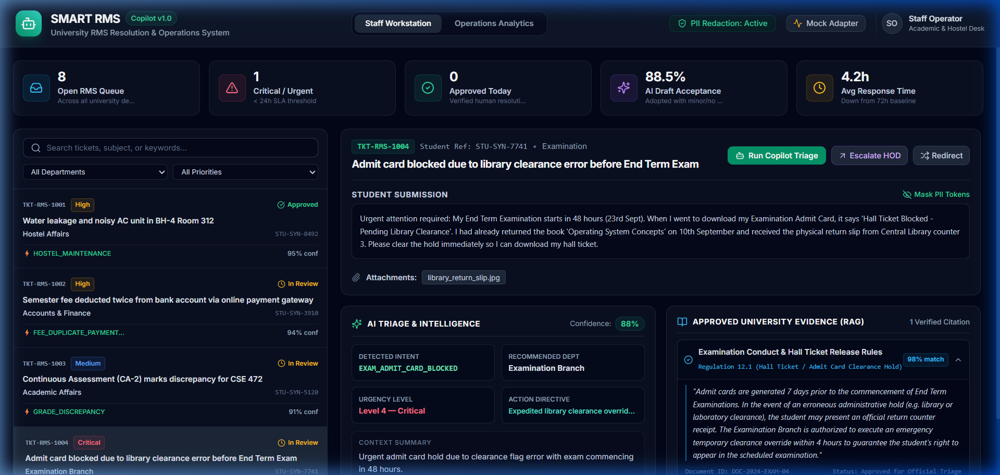

---

### 6. Academic Affairs Triage (Continuous Assessment CA Marks Discrepancy)
Inconsistency between evaluator rubric (27/30) and grade ledger record (12/30). AI matches course code `CSE 472` and routes to Academic Affairs.
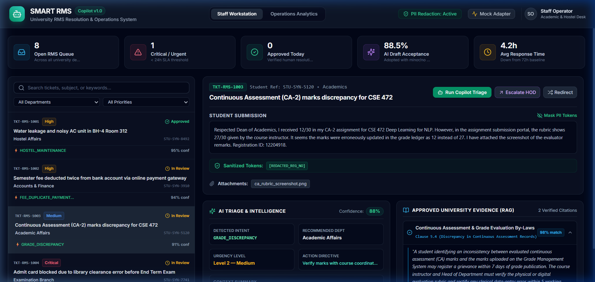

---

### 7. Student Welfare Triage (Medical Leave Attendance Condonation)
Hospitalization claim due to dengue fever. RAG matches Attendance Regulation Section 7 (Clause 7.2) for up to 10% attendance condonation upon Health Center verification.
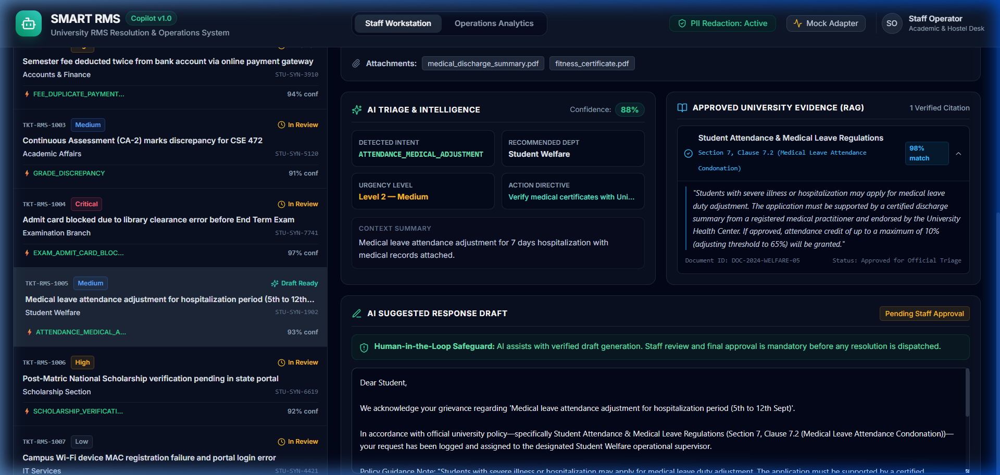

---

### 8. Operations & Workload Analytics
Institutional dashboard displaying total RMS volume, mean resolution time (4.2h vs. 72h baseline), and AI draft acceptance rate (88.5%).
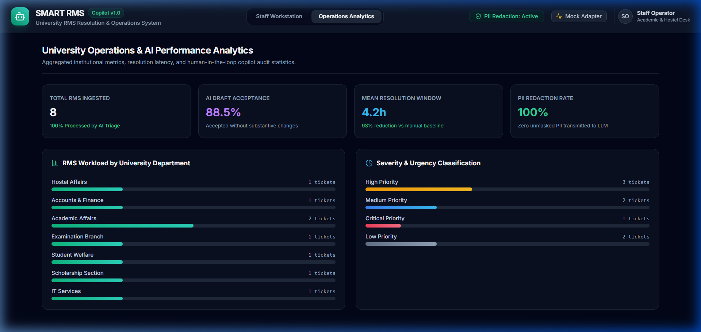

---

### 9. Departmental Workload & Severity Breakdown
Distribution of student grievances across operating branches (Hostel, Accounts, Examination, Academics) and severity levels.


---

### 10. Interactive FastAPI Swagger Documentation
Production-grade OpenAPI documentation for all health, ticket lifecycle, analytics, and RAG knowledge search endpoints.
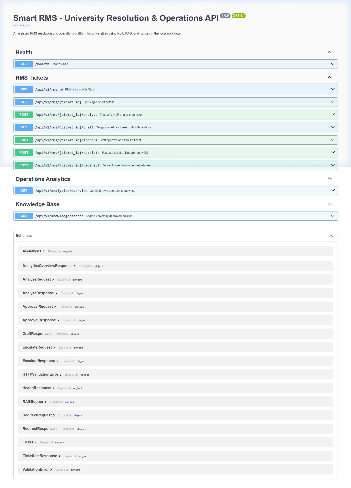

---

## 🧠 AI & NLP Pipeline Flow

```
RMS Ticket Input (Raw Text & Metadata)
         │
         ▼
[1] Preprocessing & Normalization
         │
         ▼
[2] PII Detection & Redaction (Mask sensitive student data)
         │
         ▼
[3] Intent Classification & Department Routing
         │
         ▼
[4] Priority & Urgency Scoring
         │
         ▼
[5] RAG Retrieval (Approved University Policy Base)
         │
         ▼
[6] Grounded Response Generation (Grounded LLM Prompting)
         │
         ▼
[7] Grounding & Source Citation Verification
         │
         ▼
[8] Staff Copilot Review (Human Edits, Approves, or Escalates)
         │
         ▼
Resolution Dispatched & Audit Log Recorded
```

---

## 🛠️ Technology Stack

| Layer | Technology | Description |
|---|---|---|
| **Frontend** | React 19, TypeScript, Vite, Tailwind CSS, Lucide Icons | Responsive staff triage dashboard & copilot workstation |
| **Backend** | Python 3.11+, FastAPI, Pydantic v2, Uvicorn | High-throughput asynchronous REST API & orchestration |
| **AI / NLP** | LangChain Core, Google Gemini (`gemini-1.5-flash`), Mock Provider | Provider-independent LLM pipeline with zero-key dev mode |
| **RAG / Vectors** | ChromaDB, Text Embeddings (`text-embedding-004`) | Embeddings and retrieval restricted to approved university knowledge |
| **Data Privacy** | Regex engine & Named Entity Recognition (NER) | Automated PII masking and policy compliance verification |
| **Databases** | PostgreSQL 16 (persistence), Redis 7 (caching/queuing) | Structured ticket storage, lifecycle transitions, and audit logs |
| **Infrastructure** | Docker, Docker Compose, GitHub Actions | Containerized services with automated linting and unit testing |

---

## 📊 Current Project Status

### Phase 1: Foundation & Copilot Prototype

```
Phase 1 — Foundation & Copilot Prototype
[████████████████░░░░] 80% Complete
```

- [x] Repository structure and developer standards initialized
- [x] Comprehensive architectural and product documentation created
- [x] Realistic synthetic university RMS dataset (zero student PII)
- [x] PII detection and redaction privacy engine
- [x] Provider-independent AI abstraction (`MockAIProvider` & `GeminiProvider`)
- [x] RAG vector store abstraction (`MockVectorStore` & `ChromaVectorStore`)
- [x] University system integration adapters (`MockRMSAdapter` & `FutureUMSAdapter`)
- [x] FastAPI REST API endpoints (`/health`, `/rms`, `/analyze`, `/draft`, `/approve`)
- [x] React + TypeScript + Tailwind Staff Copilot Dashboard
- [x] Automated test suite and GitHub Actions CI workflow
- [ ] Phase 2: Live Chroma ingestion of full university handbooks (Planned)
- [ ] Phase 3: Multi-role escalation workflows with email/SMS webhooks (Planned)
- [ ] Phase 4: Staging integration with university test bed (Planned)

---

## 📁 Repository Structure

```
smart-rms/
├── README.md                           # Master project documentation
├── LICENSE                             # MIT License
├── .gitignore                          # Standard gitignore
├── .env.example                        # Environment template
├── docker-compose.yml                  # Container orchestration
├── Makefile                            # Developer automation shortcuts
│
├── docs/                               # Engineering & Product Documentation
│   ├── README.md                       # Docs overview & index
│   ├── architecture/                   # Architectural blueprints
│   │   ├── system-architecture.md      # End-to-end system design
│   │   ├── ai-pipeline.md              # NLP, classification & grounding pipeline
│   │   ├── rag-architecture.md         # Document chunking & vector retrieval
│   │   ├── privacy-security.md         # PII safeguards & RBAC
│   │   └── integration-architecture.md # University adapter specifications
│   ├── product/                        # Product management specs
│   │   ├── problem-statement.md        # Detailed university operational analysis
│   │   ├── product-overview.md         # Scope, copilot role, and value metrics
│   │   ├── user-roles.md               # User personas & authorization
│   │   ├── user-stories.md             # Epics & user stories
│   │   └── roadmap.md                  # 5-phase delivery roadmap
│   ├── api/                            # API documentation
│   │   └── api-overview.md             # REST endpoints, schemas, and examples
│   └── decisions/                      # Architecture Decision Records
│       └── ADR-001-initial-architecture.md
│
├── backend/                            # FastAPI Application
│   ├── app/
│   │   ├── main.py                     # App factory & route mounting
│   │   ├── config.py                   # Pydantic environment configuration
│   │   ├── api/v1/endpoints/           # REST controllers (rms, analytics, knowledge)
│   │   ├── models/                     # Data schemas & domain models
│   │   ├── ai/                         # AIProvider interface & providers
│   │   ├── rag/                        # VectorStore interface & retrieval
│   │   ├── privacy/                    # PII detector & redactor
│   │   ├── workflows/                  # Ticket lifecycle state machine
│   │   ├── integrations/               # UniversitySystemAdapter & mock adapters
│   │   └── services/                   # Business logic orchestrator
│   ├── tests/                          # Pytest suite
│   ├── Dockerfile                      # Backend Dockerfile
│   └── requirements.txt                # Python dependencies
│
├── frontend/                           # React + TypeScript Web App
│   ├── src/
│   │   ├── components/                 # UI components (Header, Queue, Copilot Panel)
│   │   ├── pages/                      # Dashboard & Analytics views
│   │   ├── services/                   # API clients with offline mock fallback
│   │   └── types/                      # Shared TypeScript definitions
│   ├── Dockerfile                      # Frontend Dockerfile
│   └── package.json                    # Dependencies & build scripts
│
├── data/                               # Synthetic Datasets & Knowledge Base
│   ├── mock/
│   │   ├── rms_requests.json           # Realistic synthetic university tickets
│   │   ├── users.json                  # Mock staff, leads, and admins
│   │   ├── departments.json            # University departments & SLAs
│   │   └── knowledge_documents.json    # Approved policy excerpts
│   └── knowledge-base/
│       └── README.md                   # Knowledge curation standards
│
├── scripts/                            # Operational Scripts
│   ├── seed_mock_data.py               # Dataset validator & seeder
│   └── health_check.py                 # Smoke test & diagnostic utility
│
└── .github/                            # CI/CD and GitHub Templates
    ├── workflows/ci.yml                # Automated test & lint workflow
    ├── ISSUE_TEMPLATE/                 # Bug report & feature templates
    └── pull_request_template.md        # PR guidelines & checklist
```

---

## 🔒 Data Privacy & Mock Data Disclaimer

> [!CAUTION]
> **SYNTHETIC DATA NOTICE:**  
> This project operates **strictly with synthetic, fabricated mock data** during development. No real student records, university registration numbers, personal contact details, or proprietary records are stored in this repository or transmitted to third-party models.  
> 
> All student identifiers (e.g., `REG-2024-XXXX`), names, and contact entries are entirely fictional. When deployed in production environments, the system must be governed by strict university data privacy agreements, on-premise model hosting or enterprise VPC connections, and active PII sanitization.

---

## ⚡ Quickstart & Local Setup

### Prerequisites
- **Python:** 3.11 or higher
- **Node.js:** v18 or higher (v20+ recommended)
- **Git**

### 1. Clone & Setup Environment
```bash
git clone https://github.com/your-org/smart-rms.git
cd smart-rms
cp .env.example .env
```

### 2. Backend Setup
```bash
cd backend
python -m venv .venv
# On Windows:
.venv\Scripts\activate
# On macOS/Linux:
source .venv/bin/activate

pip install -r requirements.txt
uvicorn app.main:app --reload --port 8000
```
API Documentation will be available at: **http://localhost:8000/docs**

### 3. Frontend Setup
In a separate terminal:
```bash
cd frontend
npm install
npm run dev
```
Staff Copilot Dashboard will be running at: **http://localhost:5173**

### 4. Run Automated Tests
```bash
cd backend
pytest tests/ -v
```

---

## 🗺️ Roadmap Overview

- **Phase 1: Foundation (Current):** Architectural blueprint, mock adapters, PII masking, deterministic mock AI copilot, and staff triage dashboard.
- **Phase 2: RAG Pipeline & Policy Ingestion:** PyMuPDF document parser, chunking strategies, and live Chroma vector store integration.
- **Phase 3: Multi-Agent Workflows:** Department-specific LangGraph workflows, escalation hierarchies, and SLA breach monitors.
- **Phase 4: Analytics & Feedback Loop:** Staff feedback capture (draft edit distance), intent distribution analytics, and response quality scoring.
- **Phase 5: LPU UMS/RMS Integration:** Secure, authenticated enterprise adapter connecting to staging university endpoints with full audit logging.

---

## 🤝 Contributing

Please see [`docs/`](docs/) for architectural details. All contributions must adhere to the PII protection guidelines and must not introduce proprietary university credentials.

---

## 📄 License

This project is licensed under the [MIT License](LICENSE).
