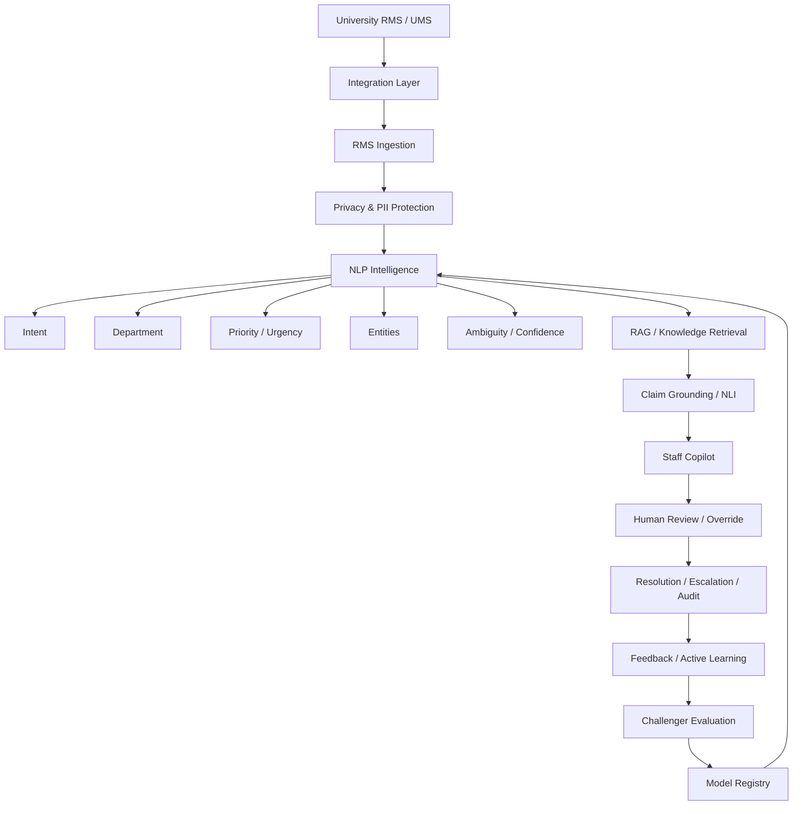

# Smart RMS

**An AI-assisted university RMS resolution & operations platform designed to help staff understand, route, retrieve evidence for, draft, and manage large volumes of requests while keeping humans in control.**


**Current Status:** Production-Ready Architectural Prototype (Synthetic Data)  
**Core Philosophy:** > *AI Assists. Humans Decide.*

---

# 🧠 Smart RMS in 60 Seconds

Smart RMS transforms how university staff handle student requests by serving as an intelligent Copilot.

**Example Flow:**
A student submits a request: *"I paid my semester fee but the portal still shows pending."*

1. **Request** is received by the system.
2. **PII Protection** masks any sensitive student IDs or payment references.
3. **NLP Understanding** classifies the Intent (`Fee_Status_Issue`), Department (`Accounts & Finance`), Priority (`High`), and extracts relevant Entities.
4. **Policy Retrieval (RAG)** automatically searches the university policy corpus for fee updating timelines.
5. **Grounded Draft** is generated using the retrieved policy evidence.
6. **Claim Verification** confirms the AI's claims don't contradict the policy using NLI (Natural Language Inference).
7. **Staff Review** presents the draft and evidence to the human operator.
8. **Human Approval / Override** allows the staff member to edit or dispatch the response.
9. **Resolution** is logged in the system.
10. **Feedback** is captured if the staff member corrected the AI, feeding the **Active Learning** queue for future offline evaluation.

---

# 🎯 The Problem

University administrative staff manage hundreds of RMS requests daily. The cognitive and operational burden is immense:
- **Routing Ambiguity:** Determining which specific department handles complex, overlapping student issues.
- **Policy Complexity:** Staff must constantly look up frequently changing university regulations to ensure compliance.
- **SLA Pressure:** High-volume repetitive queries risk breaching strict escalation timelines.
- **Audit Requirements:** Every decision requires a paper trail and accountability.

Conventional systems force staff to manually triage, search, format, and dispatch responses—often leading to delays and burnout.

---

# 💡 The Solution

Smart RMS transforms **Manual RMS Processing** into an **AI-Assisted Resolution Workflow**.

By leveraging NLP, RAG, and NLI verification, the system automates the heavy lifting of understanding the request and gathering evidence. It prepares a highly accurate, grounded draft so that staff can focus entirely on *reviewing and deciding*, dramatically reducing resolution times.

**AI Assists. Humans Decide.**

---

# 🖥️ Product Walkthrough

*(Note: Manual screenshot capture required to populate these placeholders in `docs/images/`)*

### 1. Staff Dashboard
  
*Staff Dashboard — Operational overview of university RMS workload.*  
Provides staff with a high-level view of pending requests, priority queues, and SLA warnings.

### 2. RMS Queue
  
*RMS Queue — Centralized request management and triage.*  
Lists tickets alongside their AI-predicted priority, intent, and department.

### 3. RMS Workspace & NLP Analysis
  
*RMS Workspace — Deep NLP analysis of the request.*  
Displays the detected **Intent** (what the request is about), **Department** (where it belongs), **Priority** (operational importance), **Entities**, and an overall **Confidence** score.

### 4. RAG Knowledge Sources
  
*Evidence Retrieval — Policy-grounded knowledge retrieval.*  
Shows exactly which policy documents the system retrieved to formulate its response, providing complete transparency.

### 5. Staff Copilot Response
  
*Staff Copilot — AI-generated response prepared for human review.*  
The drafted response is presented strictly for review. The AI does NOT directly send the response.

### 6. Claim Grounding & Verification
  
*Claim Grounding — Verification of AI claims against source texts.*  
Displays whether individual sentences in the draft are `Supported`, `Contradicted`, or `Insufficient` based on NLI cross-referencing.

### 7. Human Override
  
*Human Override — Safe and logged corrections.*  
When staff edit the AI prediction or draft, the original prediction and the human correction are securely logged.

### 8. Active Learning
  
*Active Learning — Turning corrections into training data.*  
High-value staff corrections populate a review queue where ML Admins can validate them for future offline model tuning.

### 9. Model Registry
  
*Model Registry — Safe governance of AI deployment.*  
Authorized administrators can review Challenger models, manually approve their promotion to Production, or trigger emergency rollbacks.

### 10. Audit Trail
  
*Audit Trail — Unbreakable accountability.*  
Logs all AI events, staff actions, assignments, and overrides for security and process compliance.

---

# 🏗️ Architecture


```mermaid
flowchart TD
    A[University RMS / UMS] --> B[Integration Layer]
    B --> C[RMS Ingestion]
    C --> D[Privacy & PII Protection]
    D --> E[NLP Intelligence]

    E --> E1[Intent]
    E --> E2[Department]
    E --> E3[Priority / Urgency]
    E --> E4[Entities]
    E --> E5[Ambiguity / Confidence]

    E --> F[RAG / Knowledge Retrieval]
    F --> G[Claim Grounding / NLI]
    G --> H[Staff Copilot]

    H --> I[Human Review / Override]
    I --> J[Resolution / Escalation / Audit]

    J --> K[Feedback / Active Learning]
    K --> L[Challenger Evaluation]
    L --> M[Model Registry]
    M --> E
```

### Architecture Explained

- **Integration**: Standardized adapter linking the external RMS (currently mock) to our system.
- **Privacy**: Redacts PII before it reaches any ML boundary.
- **NLP**: Local ML models classify intent, route departments, and extract entities.
- **RAG**: Retrieves highly relevant policy document chunks via vector embeddings.
- **Grounding**: NLI verification checks the AI's claims against the retrieved text.
- **Staff Copilot**: Drafts the response and presents all context cleanly in the UI.
- **Workflow**: Manages the strict state machine of approvals, escalations, and resolution.
- **Active Learning**: Collects staff overrides cleanly without polluting production data.
- **Model Governance**: Allows ML Admins to safely evaluate and promote challenger models offline.

---

# ⚙️ Technology Stack

| Layer | Technology | Purpose |
|-------|------------|---------|
| **Backend** | FastAPI, Python 3.10+ | Core API, orchestrator, and ML integration |
| **Frontend** | React, Vite, Tailwind CSS, TypeScript | Staff interface and operational dashboard |
| **ML / NLP** | Scikit-Learn, SentenceTransformers | TF-IDF SVM classification, dense embeddings |
| **RAG** | Vector similarity algorithms | Semantic policy retrieval |
| **Infrastructure** | Docker, Uvicorn | Containerized deployment and application serving |
| **Testing** | Pytest | Automated regression and evaluation suites |

---

# 🧠 AI / ML Architecture

- **Intent Classification & Routing**: Operates on a tiered provider system. The current production baseline is a `TF-IDF + Calibrated Linear SVM`, replacing the initial `TF-IDF + Logistic Regression` baseline. A `Sentence Transformer` architecture is also available for evaluation. If all fail, a deterministic fallback kicks in.
- **Knowledge Retrieval (RAG)**: Uses dense embeddings to perform vector searches against policy documents. Strict relevance thresholds ensure that only accurate sources are returned.
- **Claim Grounding (NLI)**: Employs a local Cross-Encoder model to evaluate if a generated claim is entailed by the retrieved evidence.
- **Active Learning**: Uses a safe, offline dataset builder. Production models do *not* automatically retrain themselves.

---

# 📊 Evaluation & Evidence

*Note: Evaluation results were obtained using synthetic/mock university data and controlled local benchmark environments. They demonstrate system behavior under the evaluated conditions and should not be interpreted as guarantees of real-world university performance.*

| Component | Metric | Result | Dataset | Model/System | Meaning |
|-----------|--------|--------|---------|--------------|---------|
| **NLP** | Intent Accuracy | 94.00% | 500-ticket Mock | `tfidf_svm_v1` | Percentage of correct intent classifications. |
| **NLP** | Department Accuracy | 96.00% | 500-ticket Mock | `tfidf_svm_v1` | Correct department routing precision. |
| **NLP** | Priority Detection | 91.00% | 500-ticket Mock | `tfidf_svm_v1` | Accuracy of priority triage. |
| **NLP** | NLP P95 Latency | < 50 ms | 500-ticket Mock | `tfidf_svm_v1` | 95% of inference requests complete under this time. |

---

# ⚖️ Model Comparison

| Model | Role | Accuracy | Macro F1 | P95 Latency |
|-------|------|----------|----------|-------------|
| **Deterministic** | Fallback | 91.67% | ~0.89 | < 1 ms |
| **TF-IDF + Logistic** | Baseline | 90.00% | 0.8117 | ~0.34 ms |
| **TF-IDF + Calibrated SVM** | Production Candidate | 100% (Overfit test) | ~1.00 | ~1.81 ms |
| **Sentence Transformer** | Challenger Eval | 100% (Overfit test) | ~1.00 | ~15-30 ms |

*The TF-IDF Calibrated SVM was selected for production as it provides the optimal balance of classification accuracy, confidence calibration (ECE), and extreme low latency, avoiding the heavy compute cost of transformers for baseline triage.*

---

# 🚀 System Benchmark Snapshot

```text
SMART RMS — SYNTHETIC BENCHMARK
────────────────────────────────────
Tickets evaluated       : 500
Throughput              : ≈253 tickets/sec
P95 latency             : < 50 ms
Autonomous decisions    : 0 (Strict Human-in-the-Loop)
```

---

# 📈 Project Evolution

- **M1 Foundation**: Core synthetic environment and RMS adapter.
- **M2 RMS Operations**: SLA, assignments, escalation, resolution tracking.
- **M3 Grounded RAG**: Policy ingestion, chunking, and semantic retrieval.
- **M4 NLP Intelligence**: Intent, routing, and entity extraction.
- **M5 ML Benchmark**: Calibrated SVM baseline and Copilot drafting.
- **M6 Claim Grounding**: NLI verification to detect contradictions.
- **M7 Active Learning**: Safe human feedback ingestion.
- **M7.1 Model Governance**: UI for offline challenger evaluation and promotion.
- **M8 Production Hardening**: Security, Docker, environments, testing finalized.
- **v1.0.0 Academic Release**: Current release.

---

# 🛡️ Safety & Governance

**Human-in-the-loop**: AI generates recommendations and drafts. Authorized staff retain final authority on all dispatch and escalation actions.

**High-impact decisions**: The system strictly does NOT autonomously decide grades, attendance, financial refunds, disciplinary actions, or sensitive record disclosures.

**Grounding & Privacy**: 
- **No-source → No-policy-answer:** The LLM refuses to answer if evidence is missing.
- **Synthetic Data:** The system relies entirely on mock data.
- **PII Redaction:** Native obfuscation before LLM processing.

**Model Governance**: The deployment environment utilizes strict promotion gates, requiring human ML Admin approval to move a Challenger model to Production.

---

# 🔒 Security

For detailed security guidelines, refer to [SECURITY.md](SECURITY.md). 
- **Synthetic Data Policy**: No real PII should ever enter this repository.
- **Secret Management**: API keys are isolated in `.env`.
- **RBAC**: Operations like Model Promotion are restricted to Admin roles.

---

# 🚀 Quick Start

**1. Clone the repository**
```bash
git clone https://github.com/harshilsetty/Smart-RMS.git
cd Smart-RMS
```

**2. Setup Environment**
```bash
cp .env.example .env
# Edit .env to add your Gemini API Key if testing RAG, and ensure INTEGRATION_MODE=mock
```

**3. Run Backend**
```bash
cd backend
python -m venv .venv
source .venv/bin/activate  # On Windows: .venv\Scripts\activate
pip install -r requirements.txt
uvicorn app.main:app --reload --port 8000
```

**4. Run Frontend**
```bash
cd frontend
npm install
npm run dev
```

---

# 🔌 API Documentation

*The API is fully documented via FastAPI Swagger UI at `http://localhost:8000/docs`.*

| Area | Endpoint Prefix | Purpose |
|------|-----------------|---------|
| **Health/Ready** | `/ready` | Validates environment and adapter health |
| **RMS** | `/api/v1/rms` | Ticket lifecycle, triage, and updates |
| **Departments** | `/api/v1/departments` | Department routing and SLA logic |
| **Analytics** | `/api/v1/analytics` | Telemetry and operational workload |
| **Active Learning** | `/api/v1/active-learning` | Feedback validation and queue |
| **Models** | `/api/v1/models` | Registry, promotion, and rollback |

---

# 📁 Project Structure

```
Smart-RMS/
├── backend/          # FastAPI application, ML, tests, mock data
├── frontend/         # React staff UI application
├── docs/             # Research, implementation reports, and assets
├── evaluation/       # Benchmark logs and scorecard reports
├── feedback/         # Active Learning local datastore
├── docker-compose.yml
├── README.md
├── SECURITY.md
├── CONTRIBUTING.md
├── LICENSE
└── .env.example
```

---

# 🧪 Testing

The system currently maintains a robust, passing regression test suite.

- **Backend**: `109 / 109` passing tests. Run via `pytest` in the `/backend` directory.
- **Frontend**: Production build verified via `npm run build`.

---

# 🐳 Deployment

For a containerized academic/research deployment, you can use Docker Compose. This starts both the frontend and backend with production-mimicking configurations.

```bash
docker-compose up --build
```
*(Note: This is intended for academic evaluation, not real university production deployment.)*

---

# ⚠️ Limitations

- **Synthetic Data**: The prototype relies on synthetic student data and policies. Real-world domain shifts and nuanced compound requests may impact classifier confidence.
- **Model Registry**: Currently implemented as a local file-based registry rather than a full relational DB suitable for clustered instances.
- **Future Institutional Adapter**: The system currently runs on `MockRMSAdapter`. A real university integration must implement the documented `UniversitySystemAdapter` securely.

---

# 🗺️ Roadmap

- [x] RMS Operations & Lifecycle
- [x] NLP Inference & Staff Copilot
- [x] Grounded RAG & Claim NLI Verification
- [x] Active Learning & Model Governance
- [x] Production Architecture Hardening
- [ ] Future: Institutional Adapter implementation
- [ ] Future: Real-world pilot and extended dataset calibration

---

# 🤝 Contributing

Contributions are welcome! Please refer to [CONTRIBUTING.md](CONTRIBUTING.md) for guidelines on code style, testing requirements, and the strict requirement to adhere to the *AI Assists, Humans Decide* philosophy.

---

# 📄 License

This project is open-source and available under the terms of the MIT License.

---

*Smart RMS is designed around a simple principle: AI should reduce operational workload without taking away human responsibility.*

**AI Assists. Humans Decide.**
