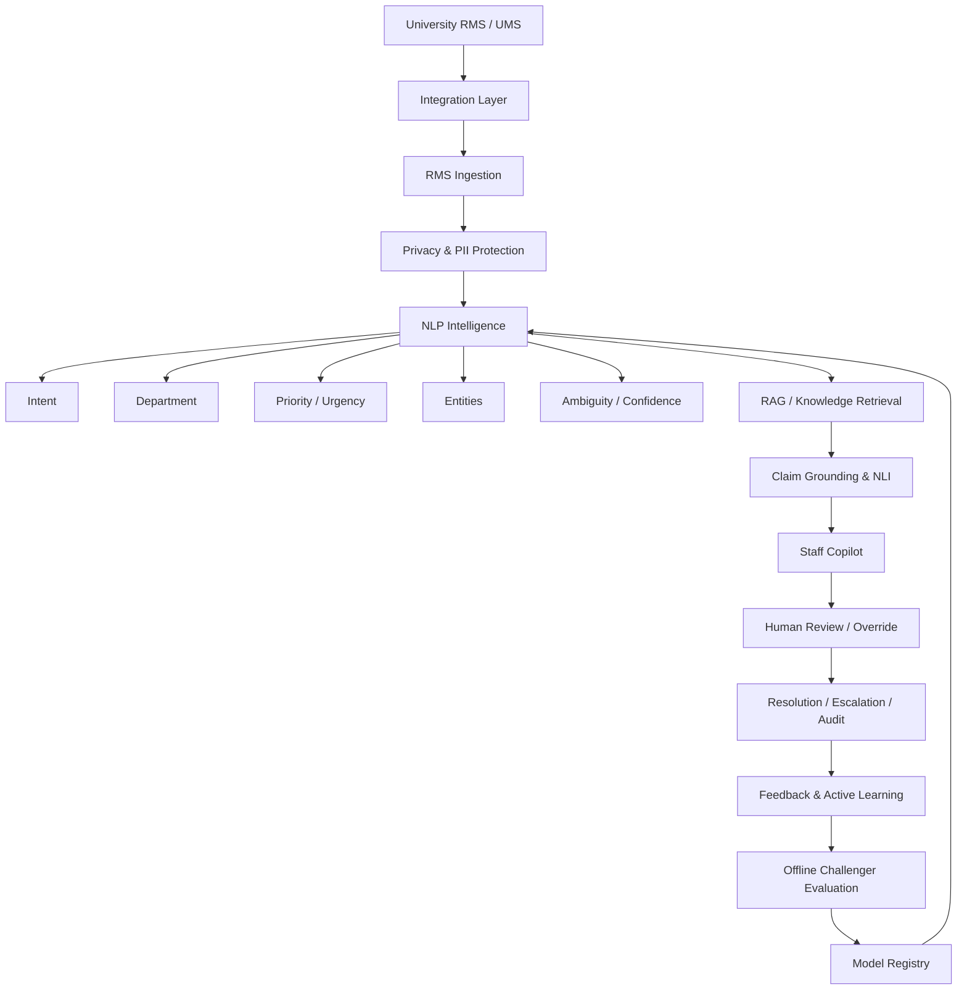

# Smart RMS

**An AI-assisted university RMS operations and resolution platform that helps staff understand, route, retrieve policy-grounded evidence, draft responses, and manage large volumes of requests while keeping humans in control.**


## Overview

Smart RMS is an architectural prototype designed to streamline university administrative workflows. It assists university staff in processing student grievance and request tickets by automatically classifying intent, predicting routing, identifying priorities, and retrieving university policy to draft grounded responses.

Crucially, Smart RMS is a **Copilot** designed to handle the scale and cognitive load of modern administrative operations without replacing the human operator. AI acts as an assistant to rapidly retrieve evidence and format drafts, while human staff maintain absolute decision-making authority.

## The Problem

University staff manage hundreds of RMS (Request Management System) requests daily. This creates severe operational bottlenecks:
- **Routing Ambiguity:** Determining which department actually handles a complex request.
- **Policy Complexity:** Staff must manually look up disparate and frequently updated university regulations to ensure compliance.
- **Volume & SLA:** Handling high-volume repetitive queries while managing strict escalation Service Level Agreements (SLAs).
- **Incomplete Context:** Students often provide ambiguous descriptions, making priority and urgency triage difficult.

The cognitive burden leads to fatigue, delayed resolutions, and occasional policy-inconsistent responses.

## The Solution

The Smart RMS workflow provides a seamless pipeline from ticket ingestion to resolution:

RMS Request → Privacy / PII Protection → NLP Understanding → Intent Classification → Entity Extraction → Priority / Urgency → Department Routing → Knowledge Retrieval → RAG → Claim Grounding / Verification → Staff Copilot → Human Review → Resolution / Escalation → Audit → Feedback → Active Learning → Offline Challenger Evaluation

Through this pipeline, AI structures the incoming chaos into actionable intelligence. Recommendations and drafts are presented, while authorized staff retain final decision authority and dispatch control.

## Core Philosophy

> **AI Assists. Humans Decide.**

Smart RMS is built around foundational safety and governance principles:
- **Human-in-the-loop:** The system does not dispatch autonomous responses or make high-impact approvals.
- **Evidence-grounded responses:** Claims are verified against retrieved university policy.
- **No-source → No-policy-answer:** If RAG cannot locate a relevant policy, the system explicitly refuses to guess.
- **Auditability:** Every state change, override, and promotion is logged.
- **PII protection:** Built-in mechanisms to redact Personally Identifiable Information before passing data to ML/LLM boundaries.
- **Synthetic Data:** The prototype leverages purely synthetic university environments to ensure safety during development.
- **Model Governance:** Explicit model registries with strict promotion gates and emergency rollback procedures.

## Key Capabilities

### RMS Operations
- Request ingestion, assignment, reassignment, and redirection
- Response threads and staff-to-student communication
- SLA tracking and automatic escalation warnings
- Secure resolution, closure, and granular audit histories

### NLP Intelligence
- Intent classification and department routing
- Priority and urgency detection
- Entity extraction (dates, IDs, locations)
- Ambiguity and confidence thresholding

### Knowledge & RAG
- Document ingestion, chunking, and semantic embeddings
- Policy-filtered retrieval with source attributions
- Grounded response generation
- Insufficient-evidence handling and fallback states

### Claim Grounding
- Claim extraction from AI drafts
- Natural Language Inference (NLI) verification
- Status mapping: Supported, Contradicted, Insufficient, or Unverified
- Draft-level grounding scores with human override mechanisms

### Staff Copilot
- AI-assisted response drafting interface
- Live evidence and source display for manual cross-referencing
- Human review, editing, and final approval required prior to dispatch

### Active Learning & Model Governance
- Non-destructive feedback capture from staff corrections
- High-value human review queue for edge cases
- Challenger evaluation environments
- Strict `PRODUCTION`, `CHALLENGER`, `ARCHIVED`, and `REJECTED` model states
- Admin-gated model promotion and emergency rollback

## Architecture


```mermaid
flowchart TD
    A[University RMS / UMS] --> B[Integration Layer]
    B --> C[RMS Ingestion]
    C --> D[Privacy & PII Protection]
    D --> E[NLP Intelligence]

    E --> E1[Intent]
    E --> E2[Department]
    E --> E3[Priority / Urgency]
    E --> E4[Entities]
    E --> E5[Ambiguity / Confidence]

    E --> F[RAG / Knowledge Retrieval]
    F --> G[Claim Grounding & NLI]
    G --> H[Staff Copilot]

    H --> I[Human Review / Override]
    I --> J[Resolution / Escalation / Audit]

    J --> K[Feedback & Active Learning]
    K --> L[Offline Challenger Evaluation]
    L --> M[Model Registry]
    M --> E
```

## ML Results & Benchmarks

The NLP pipeline is evaluated using a frozen synthetic benchmark dataset containing 500 tickets. Current `tfidf_svm_v1` production benchmark results:

- **Intent Accuracy**: ~94%
- **Department Routing**: ~96%
- **Priority Detection**: ~91%
- **Latency**: <50ms per inference

*Note: All tests and benchmarks rely strictly on **synthetic** generated student queries to preserve privacy. No genuine LPU ticket data is used in this repository.*

## Project Structure

```
Smart RMS/
├── backend/
│   ├── app/          # FastAPI application, routers, services, adapters
│   ├── data/         # Mock synthetic university data 
│   ├── ml/           # Machine learning pipelines, dataset builder, eval logic
│   └── tests/        # Pytest regression suite
├── frontend/         # React, Vite, Tailwind CSS staff UI
├── feedback/         # Local datastore for Active Learning model registry
├── evaluation/       # Evaluation reports (Benchmarks, Architecture, Readiness)
└── docs/             # Documentation (Research, API, Demo, Architecture)
```

## Setup & Deployment

1. **Clone the repository.**
2. **Environment**: Copy `.env.example` to `.env` and configure accordingly. Ensure `INTEGRATION_MODE=mock`.
3. **Backend**:
```bash
cd backend
python -m venv .venv
source .venv/bin/activate
pip install -r requirements.txt
uvicorn app.main:app --reload
```
4. **Frontend**:
```bash
cd frontend
npm install
npm run dev
```

Alternatively, use Docker Compose for an isolated deployment:
```bash
docker-compose up --build
```

## Future Integration Note

The current prototype relies entirely on the `MockRMSAdapter`. Integration with the LPU UMS or external university systems requires authorized IT personnel to implement the documented `UniversitySystemAdapter` contract. 
