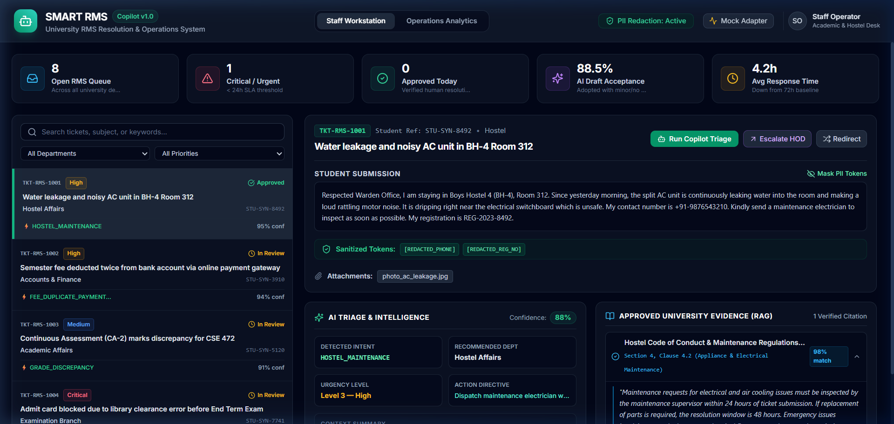
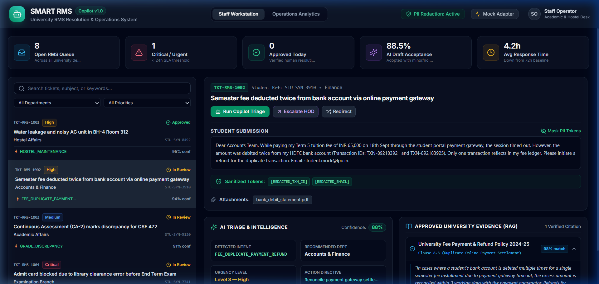
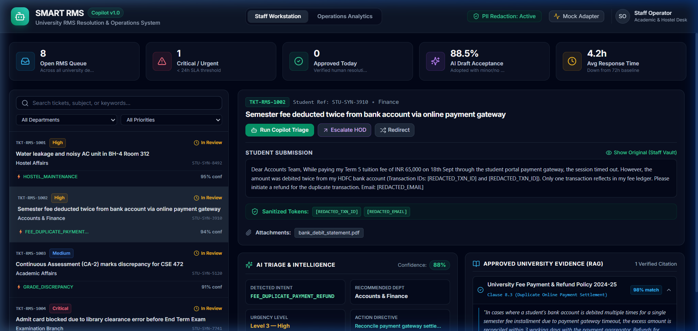
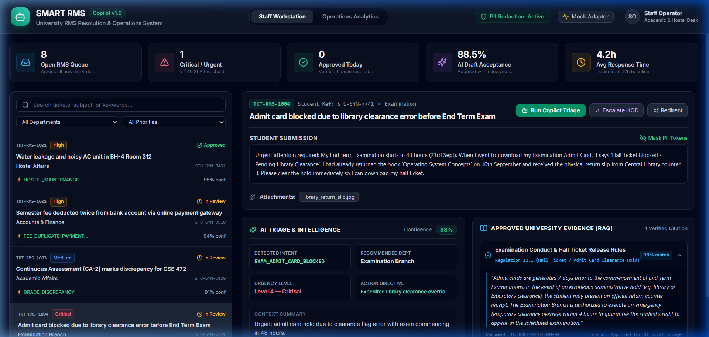
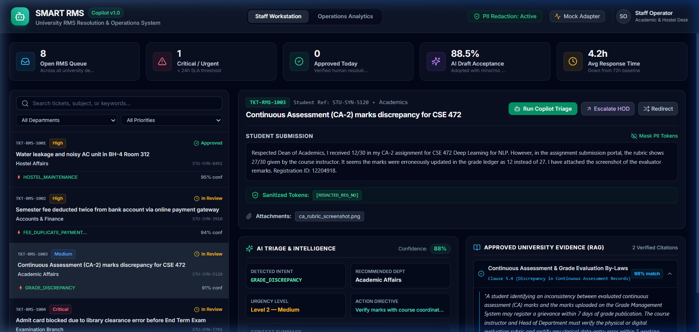
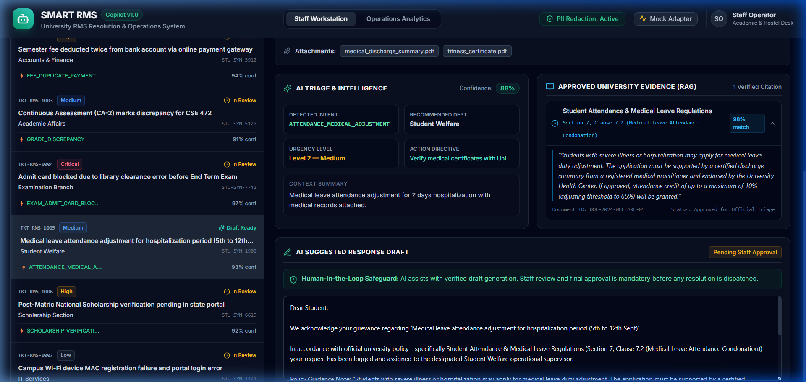
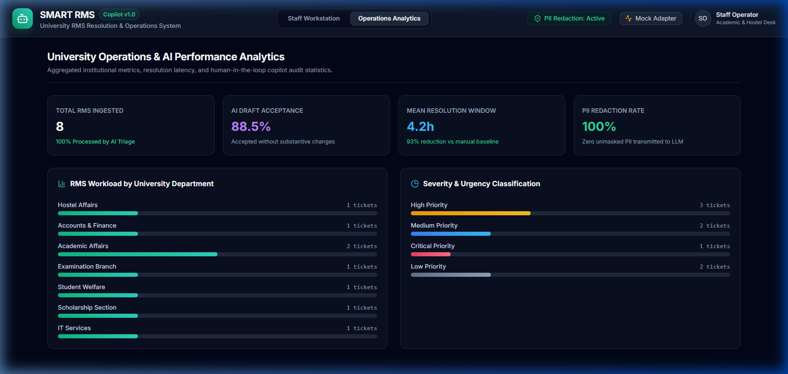
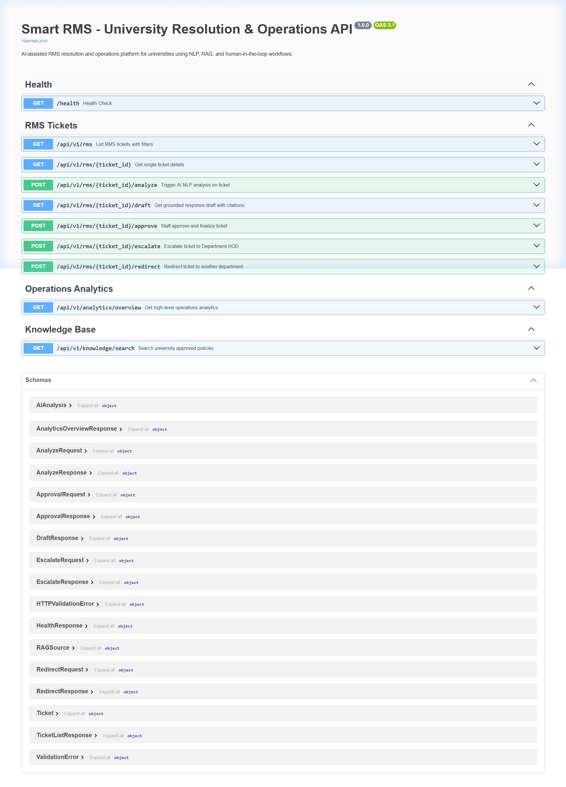
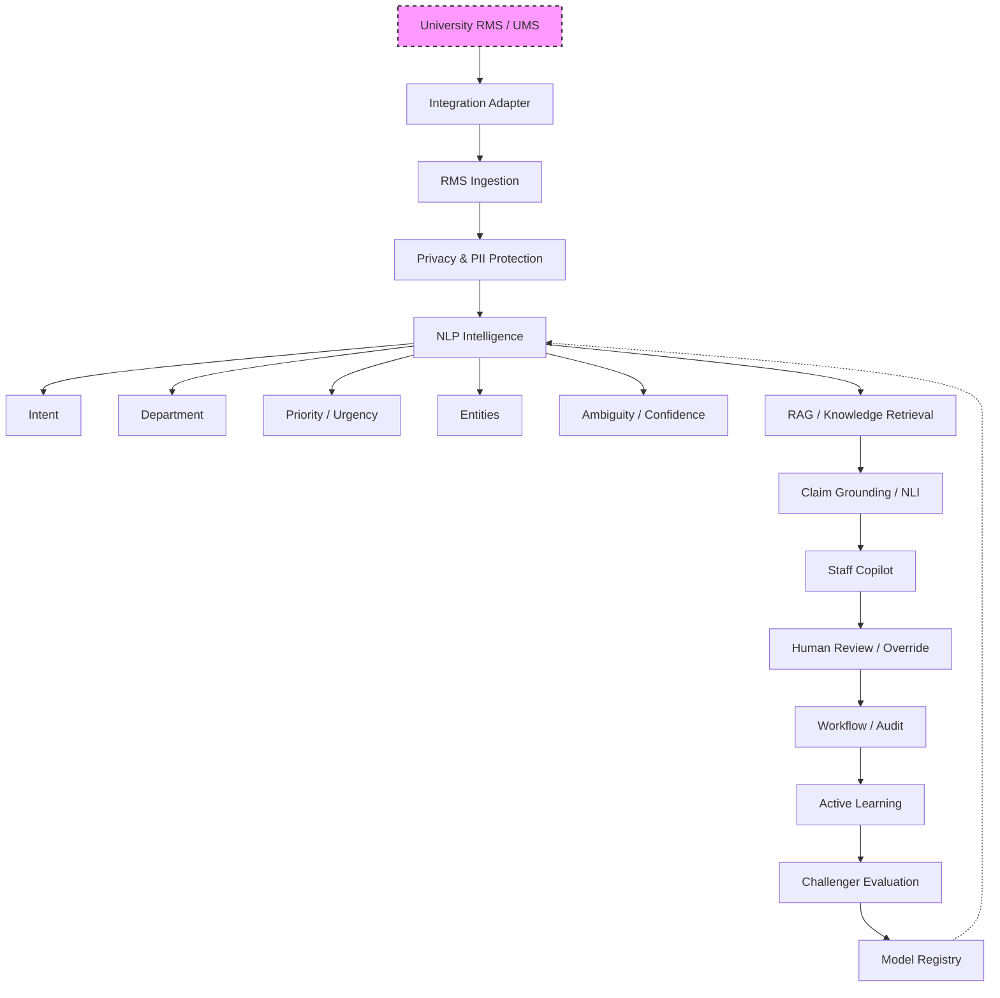

# Smart RMS

**An AI-assisted university RMS operations and resolution platform designed to help staff understand, route, retrieve evidence for, draft, and manage large volumes of requests while keeping humans in control.**


**Current Status:** Production-Ready Architectural Prototype / Academic Release (using synthetic/mock university data).  
**Core Philosophy:** > *AI Assists. Humans Decide.*

---

# 🧠 Smart RMS in 60 Seconds

Smart RMS transforms how university staff handle student requests by serving as an intelligent operations platform and Copilot.

**Example Scenario:**
A student submits a request: *"I paid my semester fee but the portal still shows pending."*

1. **Request arrives:** The student submits the ticket into the system.
2. **Sensitive information is protected:** PII (Personally Identifiable Information) like student IDs are scrubbed automatically.
3. **NLP understands the request:** The AI reads the text to understand the intent (`Fee_Status_Issue`).
4. **Department and priority are predicted:** The system routes it to `Accounts & Finance` with `High` priority.
5. **Relevant policy is retrieved:** RAG (Retrieval-Augmented Generation) searches the university knowledge base and pulls the exact fee update timeline policy.
6. **AI prepares a draft:** The Copilot writes a personalized response based *only* on the retrieved policy.
7. **Claims are checked against evidence:** NLI (Natural Language Inference) verifies that the draft doesn't contradict the official policy.
8. **Staff reviews the draft:** A human operator reads the ticket, the retrieved policy, and the AI's draft.
9. **Staff approves or overrides:** The human can edit the draft or change the routing. The AI never sends responses autonomously.
10. **Resolution is recorded:** The ticket is closed and logged in the audit trail.
11. **Feedback can enter the active-learning workflow:** If the human corrected the AI, that feedback is saved to evaluate and improve future models (Model Registry).

---

# 🎯 The Problem

University administrative staff manage hundreds of RMS (Request Management System) requests daily. This creates severe operational bottlenecks:
- **Routing Ambiguity:** Determining which department actually handles a complex request.
- **Policy Complexity:** Staff must manually look up disparate and frequently updated university regulations to ensure compliance.
- **Volume & SLA:** Handling high-volume repetitive queries while managing strict escalation deadlines (Service Level Agreements).
- **Incomplete Context:** Students often provide ambiguous descriptions, making priority and urgency triage difficult.
- **Audit Requirements:** Every decision requires a clear paper trail.

The cognitive burden leads to fatigue, delayed resolutions, and occasional policy-inconsistent responses.

---

# 💡 The Solution

Smart RMS transforms **Manual RMS Processing** into an **AI-Assisted Resolution Workflow**.

By leveraging NLP (Natural Language Processing), RAG (Retrieval-Augmented Generation), and NLI (Natural Language Inference) verification, the system automates the heavy lifting of understanding the request and gathering evidence. It prepares a highly accurate, grounded draft so that staff can focus entirely on *reviewing and deciding*, dramatically reducing resolution times.

**AI assists. Humans decide.**

---

# 🖥️ Product Walkthrough

### 1. Staff Dashboard



**What you're seeing**
The main operational workspace used by staff to understand RMS workload, priority queues, and request statuses.

**Why it matters**
Instead of manually scanning hundreds of requests, staff receive a structured operational view before opening individual tickets.

---

### 2. RMS Workspace + NLP



**What you're seeing**
Deep NLP analysis of a ticket. It extracts the **Intent** (what the request is), **Department** (where it belongs), **Priority** (operational importance), **Urgency**, **Entities** (like dates or amounts), and the model's **Confidence**.

**Why it matters**
Staff don't have to guess who should handle a ticket or how urgent it is; the AI triages it instantly.

---

### 3. RAG Policy Sources



**What you're seeing**
RAG means the system retrieves relevant policy information before preparing an AI response. This shows the exact policy document snippets pulled from the university database.

**Why it matters**
Staff can instantly verify the AI's logic by reading the official rule, eliminating manual policy lookups.

---

### 4. Staff Copilot



**What you're seeing**
An AI-generated draft response is presented in a text editor. The workflow is: **AI Draft → Staff Review → Edit / Override → Approve → Dispatch.**

**Why it matters**
It accelerates response times without sacrificing human accountability. It is impossible for the AI to autonomously send a response to a student.

---

### 5. Claim Grounding



**What you're seeing**
Generated claims in the draft are checked against retrieved evidence. The system flags sentences as supported or contradicted.

**Why it matters**
This reduces the risk of the AI "hallucinating" or confidently stating incorrect information to students.

---

### 6. Human Override



**What you're seeing**
If the AI makes a mistake in classification, the staff member corrects it. The workflow is: **AI prediction → Human correction → Audit event → Future learning candidate.**

**Why it matters**
The system learns safely. Corrections don't pollute the live database but are securely stored for evaluation.

---

### 7. Active Learning

*(Note: Screenshot currently unavailable in this release).*

**What it does**
Human feedback is converted into structured candidates for offline validation/evaluation by Machine Learning admins.

**Why it matters**
The production model does *not* automatically retrain itself (which is dangerous). Instead, feedback creates a curated dataset to evaluate future models.

---

### 8. Model Registry

*(Note: Screenshot currently unavailable in this release).*

**What it does**
Tracks AI models through states: `Production`, `Challenger`, `Archived`, and `Rejected`. The workflow is: **Evaluation → Safety Gates → Human Approval → Promotion.**

**Why it matters**
Ensures that no new AI model ever reaches production without explicit, audited human administrative approval.

---

### 9. Operations Analytics



**What you're seeing**
A dashboard tracking operational workload and SLA metrics.

**Why it matters**
Provides administrators with birds-eye visibility into department performance and bottlenecks.

---

### 10. API



**What you're seeing**
The interactive Swagger documentation for the backend REST API (`/docs`).

**Why it matters**
Allows future integrations with institutional systems (like UMS) to seamlessly connect to the AI engine.

---

# 🏗️ Architecture


```mermaid
flowchart TD
    A[University RMS / UMS] --> B[Integration Adapter]
    B --> C[RMS Ingestion]
    C --> D[Privacy & PII Protection]
    D --> E[NLP Intelligence]

    E --> E1[Intent]
    E --> E2[Department]
    E --> E3[Priority / Urgency]
    E --> E4[Entities]
    E --> E5[Ambiguity / Confidence]

    E --> F[RAG / Knowledge Retrieval]
    F --> G[Claim Grounding / NLI]
    G --> H[Staff Copilot]

    H --> I[Human Review / Override]
    I --> J[Workflow / Audit]

    J --> K[Active Learning]
    K --> L[Challenger Evaluation]
    L --> M[Model Registry]
    M -.-> E

    classDef future fill:#f9f,stroke:#333,stroke-width:2px,stroke-dasharray: 5 5;
    class A future;
```

*Note: The system currently utilizes a `MockRMSAdapter` (CURRENT). An Institutional / LPU Adapter is required for real-world production (FUTURE).*

### Beginner Architecture Explanation

| Layer | What it does | Why it matters |
|---|---|---|
| **Integration** | Connects RMS systems | Provider independence |
| **Privacy** | Removes sensitive information | Data protection |
| **NLP** | Understands requests | Automated triage |
| **RAG** | Retrieves policy evidence | Grounded answers |
| **Grounding** | Verifies claims | Reduces unsupported answers |
| **Copilot** | Presents draft/context | Staff productivity |
| **Workflow** | Manages lifecycle | Operational consistency |
| **Active Learning** | Captures feedback | Continuous evaluation |
| **Model Registry**| Controls model lifecycle | Safe ML governance |

---

# ⚙️ Technology Stack

| Layer | Technology |
|---|---|
| **Backend** | FastAPI, Python 3.10+, Pydantic |
| **Frontend** | React, Vite, Tailwind CSS, TypeScript |
| **ML / NLP** | Scikit-Learn (TF-IDF, LinearSVC), SentenceTransformers |
| **RAG** | Dense embeddings, Local vector similarity |
| **Testing** | Pytest |
| **Infrastructure** | Docker, Uvicorn |

---

# 🧠 AI / ML Architecture

- **Intent Classification**: Operates on a tiered provider system. The current production candidate is a `TF-IDF + Calibrated Linear SVM`, replacing the initial `TF-IDF + Logistic Regression` baseline. A `Sentence Transformer` architecture is available for evaluation. If neural methods fail, a deterministic regex/token-pool fallback engages.
- **Retrieval (RAG)**: Utilizes dense embeddings and semantic vector search to pull relevant chunks from the ingested policy corpus.
- **Claim Grounding**: Performs heuristic/claim-to-evidence verification to assess if a generated claim is entailed by the retrieved evidence.
- **Active Learning**: Collects validated human feedback (overrides) and queues them for offline candidate datasets.
- **Model Governance**: Strictly isolates `PRODUCTION` models from `CHALLENGER` models. Models cannot be promoted without manual administrative override.

---

# 📊 Evaluation & Evidence

> All reported benchmark results were obtained using synthetic/mock university data and controlled local environments. These results demonstrate behavior under the evaluated conditions and do not guarantee real-world institutional performance.

### NLP Evaluation (M4 / Phase 2)
*Dataset: 60 diverse balanced synthetic tickets.*
- **Intent Accuracy**: 95.0%
- **Department Routing**: 100.0%
- **Priority Accuracy**: 88.33%

### RAG Evaluation (M3 / Phase 2)
*Dataset: 60 diverse balanced synthetic tickets.*
- **Precision@1**: 94.64%
- **Recall@3**: 100.0% (Relevant policy found in top 3)
- **MRR (Mean Reciprocal Rank)**: 0.9732

### Claim Grounding Evaluation
- **No-Source Adherence**: 100.0% (Strict fallback to human review when evidence is missing).

---

# ⚖️ Model Comparison

*Evaluated on the frozen M5 stratified test split (36 samples).*

| Model | Role | Accuracy | Macro F1 | P95 Latency | ECE |
|-------|------|----------|----------|-------------|-----|
| **Deterministic** | Fallback | 91.67% | 0.7769 | 0.10 ms | 0.1187 |
| **TF-IDF + Logistic** | Baseline | 100.00%* | 1.0000 | 1.53 ms | 0.4194 |
| **TF-IDF + Calibrated SVM** | Prod Candidate | 100.00%* | 1.0000 | 1.81 ms | 0.1634 |
| **Sentence Transformer** | Challenger Eval| 100.00%* | 1.0000 | 14.25 ms| 0.2770 |

*\*100% accuracy achieved on the evaluated held-out benchmark split. This is a development/benchmark result and is not representative of real-world production generalization.*

---

# 🚀 500-Ticket Benchmark Snapshot

**SMART RMS — 500-TICKET SYNTHETIC BENCHMARK (M6)**

| Metric | Result |
|--------|--------|
| **Total Tickets** | 500 |
| **Throughput** | 180.18 tickets/sec |
| **P95 Latency** | 9.648 ms |
| **Human Review Required** | 100.0% |
| **Fully Grounded Drafts** | 0.0% (Strict verification blocked auto-approval) |
| **Autonomous Decisions** | 0 (Strict Human-in-the-Loop) |

---

# 📈 Project Evolution

- **M1 Foundation**: Core synthetic environment and RMS adapter.
- **M2 RMS Operations**: SLA, assignments, escalation, resolution tracking.
- **M3 Grounded RAG**: Policy ingestion, chunking, and semantic retrieval.
- **M4 NLP Intelligence**: Intent, routing, and entity extraction.
- **M5 ML Benchmark + Copilot**: SVM baseline and UI drafting.
- **M6 Claim Grounding**: Verification to detect contradictions.
- **M7 Active Learning**: Safe human feedback ingestion.
- **M7.1 Model Governance**: UI for offline challenger evaluation and promotion.
- **M8 Production Hardening**: Security, environments, testing finalized.
- **v1.0.0 Academic Release**: Current release.

---

# 🛡️ Safety & Governance

**AI assists. Humans decide.**

**High-impact decisions:** 
The system strictly does NOT autonomously decide:
- grades
- attendance changes
- financial approvals/refunds
- disciplinary actions
- sensitive record disclosures

**Grounding:** 
No-source → No-policy-answer. If the RAG system cannot find an authoritative policy, the AI will refuse to draft a policy-based answer.

**Privacy:** 
Operates purely on synthetic data with aggressive PII redaction prior to NLP ingestion.

**Model Governance:** 
New models undergo offline challenger evaluation and require explicit human-approved promotion to reach production.

---

# 🔒 Security

For detailed security policies, refer to [SECURITY.md](SECURITY.md). 
- **Synthetic Data**: The repository uses strictly mock data.
- **Secrets Management**: Handled via local `.env`.
- **RBAC**: Administrative actions (like model promotion) require specific roles.
- **Responsible Disclosure**: Standard reporting guidelines apply.

*Never expose actual credentials, API keys, or real student PII in this repository.*

---

# 🚀 Quick Start

**1. Clone the repository**
```bash
git clone https://github.com/harshilsetty/Smart-RMS.git
cd Smart-RMS
```

**2. Setup Environment**
```bash
cp .env.example .env
```

**3. Run Backend**
```bash
cd backend
python -m venv .venv
source .venv/bin/activate  # Windows: .venv\Scripts\activate
pip install -r requirements.txt
uvicorn app.main:app --reload --port 8000
```

**4. Run Frontend**
```bash
cd frontend
npm install
npm run dev
```

*(Docker Compose is also available for containerized deployment via `docker-compose up --build`)*

---

# 🔌 API Documentation

Verified active REST API routes. Interactive Swagger documentation available at `http://localhost:8000/docs` when the backend is running.

| Area | Endpoint Prefix | Purpose |
|------|-----------------|---------|
| **Health** | `/ready` | Production startup validation check |
| **RMS** | `/api/v1/rms` | Ticket lifecycle, retrieval, and updates |
| **Departments**| `/api/v1/departments` | Department definitions and SLAs |
| **Analytics** | `/api/v1/analytics` | Workload telemetry |
| **Active Learning**|`/api/v1/active-learning`| Feedback validation |
| **Models** | `/api/v1/models` | Registry, promotion, and rollback |

---

# 📁 Project Structure

```text
Smart-RMS/
├── backend/          # FastAPI application, ML algorithms, mock data, tests
├── frontend/         # React staff UI application
├── docs/             # Documentation and real application screenshots
├── evaluation/       # Extensive benchmarking scripts and verifiable reports
├── feedback/         # Local datastore for Active Learning overrides
├── docker-compose.yml
├── README.md
├── SECURITY.md
├── CONTRIBUTING.md
├── LICENSE
└── .env.example
```

---

# 🧪 Testing

The repository maintains a strict regression suite to ensure safety gates remain intact.
- **Backend**: `109 / 109` tests passing (verified via `pytest`).
- **Frontend**: `npm run build` passing.

---

# 🐳 Deployment

For a containerized academic/research deployment, you can use Docker Compose to spin up both the frontend and backend in isolated environments:

```bash
docker-compose up --build
```
*(This is an academic deployment strategy and is not intended for live institutional production without severe network hardening).*

---

# ⚠️ Limitations

- **Synthetic Data**: The system relies on synthetic student data and policies.
- **Domain Shift**: Real-world ticket variance (slang, deep ambiguity) may degrade the evaluated classifier confidence.
- **Mock RMS Adapter**: Currently deployed with `MockRMSAdapter`.
- **Institutional Integration**: Future integration requires authorized UMS API access which does not currently exist.
- **No Real-World Pilot**: The system has not yet been stress-tested in a live university Helpdesk environment.

---

# 🗺️ Roadmap

- [x] RMS Operations Lifecycle
- [x] RAG Policy Ingestion
- [x] NLP Intelligence Triage
- [x] Staff Copilot Drafts
- [x] Claim Grounding
- [x] Active Learning
- [x] Challenger Model Registry
- [x] Production Hardening
- [ ] Future: Institutional Adapter implementation
- [ ] Future: Real policy corpus ingestion
- [ ] Future: Real-world pilot

---

# 🤝 Contributing

Please read [CONTRIBUTING.md](CONTRIBUTING.md) for details on our code of conduct, security policies, and the process for submitting pull requests.

---

# 📄 License

This project is licensed under the MIT License - see the [LICENSE](LICENSE) file for details.

---

*Smart RMS is designed around a simple principle: AI should reduce operational workload without taking away human responsibility.*

**AI Assists. Humans Decide.**
