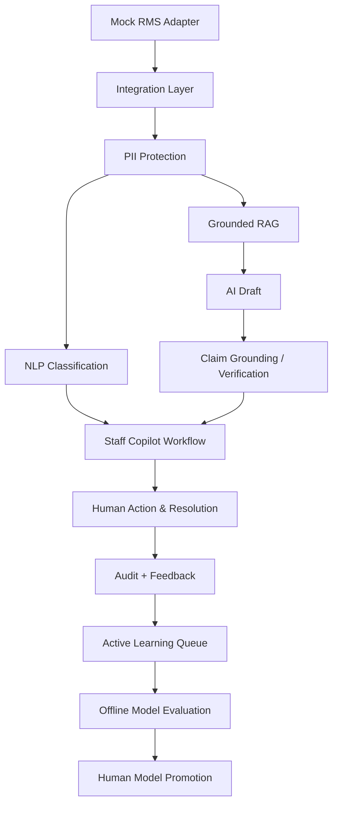

# Smart RMS

**A production-ready architectural prototype using synthetic university data for AI-assisted RMS operations.**

## Problem Statement

University administrative staff face intense pressure from hundreds of daily RMS (Request Management System) tickets. The manual workflow requires staff to triage requests, identify the correct routing department, look up complex university policies, draft personalized responses, and manage SLA deadlines. This process is time-consuming, prone to human error, and often results in delayed responses to urgent student needs.

## Solution

Smart RMS introduces an AI-assisted staff workflow. By integrating NLP classification and Grounded RAG (Retrieval-Augmented Generation), the system automates the heavy lifting of routing, priority assessment, and initial response drafting based on actual university policy documents. 

## Core Principle

**AI ASSISTS. HUMANS DECIDE.**
The system strictly enforces human-in-the-loop operations. High-impact decisions, such as finalizing a response or escalating a ticket, require explicit human authorization. The AI acts as a Copilot, not an autonomous agent.

## Key Features

- **RMS Lifecycle Management**: Full tracking of tickets from ingestion to resolution.
- **NLP Classification**: Automated routing and priority/urgency assessment.
- **Grounded RAG**: Retrieval-augmented generation strictly grounded in university policy.
- **Claim Verification**: NLI-based contradiction detection to prevent AI hallucinations.
- **Staff Copilot**: Draft suggestions and UI to accept, reject, or edit AI drafts.
- **Active Learning**: Non-destructive human feedback capture for offline model retraining.
- **Model Governance**: Strict model registry with manual promotion and emergency rollback capabilities.

## Architecture


```mermaid
graph TD
    A[Mock RMS Adapter] --> B[Integration Layer]
    B --> C[PII Protection]
    C --> D[NLP Classification]
    C --> E[Grounded RAG]
    E --> F[AI Draft]
    F --> G[Claim Grounding / Verification]
    D --> H[Staff Copilot Workflow]
    G --> H
    H --> I[Human Action & Resolution]
    I --> J[Audit + Feedback]
    J --> K[Active Learning Queue]
    K --> L[Offline Model Evaluation]
    L --> M[Human Model Promotion]
```

## Technology Stack

- **Backend**: FastAPI, Python 3.10+, Pydantic
- **Frontend**: React, TypeScript, Vite, TailwindCSS
- **ML / NLP**: Scikit-Learn (TF-IDF + SVM baseline), SentenceTransformers
- **Testing**: Pytest

## Setup

1. **Clone the repository.**
2. **Environment**: Copy `.env.example` to `.env`
3. **Backend**:
```bash
cd backend
python -m venv .venv
source .venv/bin/activate
pip install -r requirements.txt
uvicorn app.main:app --reload
```
4. **Frontend**:
```bash
cd frontend
npm install
npm run dev
```

## Testing
The backend features a robust regression suite.
Currently maintaining **109** automated tests. Run them via:
```bash
pytest
```

## Future University Integration
The current prototype relies on `MockRMSAdapter` and synthetic student data to ensure privacy and security. A future authorized integration will implement the documented `UniversitySystemAdapter` contract to communicate securely with LPU/UMS.

## Safety & Limitations
- **No autonomous high-impact decisions**: Drafts must be approved.
- **No-source/no-answer**: RAG will refuse to answer if a policy is not found.
- **Limitations**: As an academic prototype relying on synthetic data, organic human feedback volume is currently limited. Challenger model evaluation defaults to a mock pass for demonstration of the safety gates architecture.
