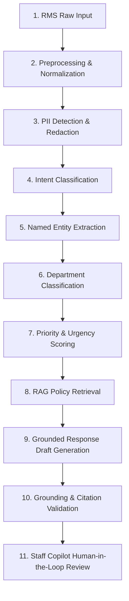

# AI & NLP Pipeline: Smart RMS

## 1. Pipeline Overview

The Smart RMS AI pipeline is engineered to be **deterministic, grounded, privacy-preserving, and verifiable**. It avoids brittle monolithic prompts by separating the analysis into modular stages, each with explicit input/output contracts, confidence thresholds, and safety checkpoints.

---

## 2. Detailed Stage Specifications

### Stage 1: RMS Raw Input
- **Inputs:** Ticket subject, student description text, attached metadata (timestamp, student year, program), attachment references.
- **Validation:** Enforces maximum character limits (4,000 characters) and UTF-8 encoding validation.

### Stage 2: Preprocessing & Normalization
- **Text Cleansing:** Normalizes whitespace, strips extraneous control characters, expands common academic acronyms (e.g., "CA" -> "Continuous Assessment", "ETE" -> "End Term Examination").
- **Language Detection:** Identifies the primary language (English standard, supports university-specific phrasing).

### Stage 3: PII Detection & Redaction
- **Objective:** Prevent leakage of personally identifiable information into downstream LLMs and vector embeddings.
- **Entity Types Targeted:**
  - Phone Numbers (e.g., `+91-9876543210`) -> `[REDACTED_PHONE]`
  - Student Registration Numbers (e.g., `12204892` or `REG-2023-XXXX`) -> `[REDACTED_REG_NO]`
  - Email Addresses (`student@lpu.in`) -> `[REDACTED_EMAIL]`
  - Financial Data (bank account numbers, transaction IDs, UPI IDs) -> `[REDACTED_TXN_ID]`
  - Personal Identification (Aadhaar, Passport references) -> `[REDACTED_ID]`
- **Preservation:** A token hash map is preserved within the backend transaction memory so authorized staff can view the original text if needed for administrative validation.

### Stage 4: Intent Classification
- **Classes:**
  - `GRADE_GRIEVANCE`
  - `FEE_REFUND_INQUIRY`
  - `FEE_PAYMENT_FAILURE`
  - `HOSTEL_MAINTENANCE`
  - `HOSTEL_ROOM_CHANGE`
  - `EXAM_REVALUATION`
  - `ATTENDANCE_MEDICAL_LEAVE`
  - `SCHOLARSHIP_DISBURSEMENT`
  - `IT_PORTAL_ACCESS`
  - `DOCUMENT_REQUEST`
  - `GENERAL_INQUIRY`
- **Scoring:** Outputs primary intent and probability score ($P \in [0.0, 1.0]$). If $P < 0.65$, marked as `UNCERTAIN_INTENT`.

### Stage 5: Named Entity Extraction (NER)
- **Entities Extracted:**
  - `COURSE_CODE` (e.g., `CSE472`, `MTH101`)
  - `TERM_OR_SEMESTER` (e.g., `Fall 2024`, `Term 5`)
  - `HOSTEL_BLOCK` (e.g., `BH-4`, `GH-2`)
  - `DATE_OR_DEADLINE` (e.g., `15th October`)
  - `AMOUNT` (e.g., `INR 15,000`)
- **Utility:** These entities provide the exact filter parameters passed into vector knowledge retrieval.

### Stage 6: Department Classification
- **Routing Engine:** Maps the inquiry to one of the university operating units:
  - `ACADEMIC_AFFAIRS`
  - `EXAMINATION_BRANCH`
  - `ACCOUNTS_AND_FINANCE`
  - `HOSTEL_AND_RESIDENTIAL`
  - `STUDENT_WELFARE`
  - `IT_SERVICES`
- **Conflict Handling:** If the student's selected category differs from the AI-detected department, both are flagged for the staff reviewer with a visual discrepancy alert.

### Stage 7: Priority & Urgency Scoring
- **Urgency Formula:**
  $$\text{Urgency Score} = \min\left(5, w_1 \cdot C_{\text{intent}} + w_2 \cdot D_{\text{deadline}} + w_3 \cdot M_{\text{sentiment}}\right)$$
- **Score Levels:**
  - **Level 1 (Low):** General information requests, standard documentation with >14 days SLA.
  - **Level 2 (Medium):** Normal maintenance, routine fee queries with 7-14 days SLA.
  - **Level 3 (High):** Exam admit card issues within 48 hours, medical leave adjustment deadlines.
  - **Level 4 (Critical):** Immediate health/safety concerns, unauthorized fee debit, impending de-registration.

### Stage 8: RAG Policy Retrieval
- **Query Formulation:** Combines the redacted ticket subject, intent, and extracted entities into an optimized semantic query.
- **Metadata Filtering:** Restricts search to approved documents matching the identified department and current academic year.
- **Output:** Top $K=3$ document chunks with relevance cosine scores $\ge 0.70$.

### Stage 9: Grounded Response Draft Generation
- **Prompt Guardrails:**
  - System prompt instructs the model to answer *solely* using the provided policy excerpts.
  - Required tone: Professional, empathetic, clear, actionable, university-compliant.
  - Prohibits hallucinating dates, amounts, or guarantees not explicitly present in the context.
- **Template Schema:**
  1. Formal Greeting & Acknowledgment.
  2. Policy-grounded explanation or required student action.
  3. Clear next steps and turnaround time.
  4. Closing with department signature block.

### Stage 10: Grounding & Citation Validation
- **Source Verification:** Every substantive factual statement in the draft is mapped back to an exact source document, chapter, and clause.
- **No-Source-No-Answer Rule:** If no policy chunk scores above the threshold, the generation engine refuses to hallucinate and produces:
  > *"No matching university policy could be confirmed for this query. Flagged for manual staff investigation."*

### Stage 11: Human-in-the-Loop Review
- The resulting draft, triage tags, and source citations are rendered on the Staff Copilot Dashboard.
- Staff members have full autonomy to edit the draft, replace citations, reroute the ticket, or approve the final message.
