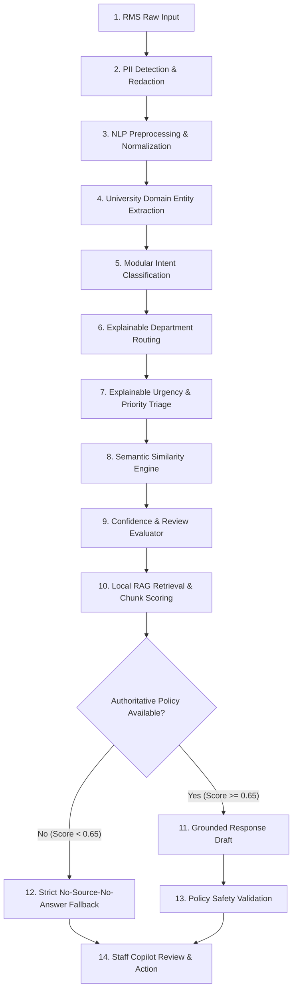

# AI & NLP Pipeline Architecture — Smart RMS Phase 2

## 1. Pipeline Overview & Principles

Smart RMS is an AI-assisted University Resolution & Operations System designed under the governing principle:
> **"AI assists. Humans decide."**

In Phase 2, the system implements a modular, measurable, and human-in-the-loop NLP pipeline that transforms raw student grievance submissions into structured triage records, authoritative policy retrievals, and safely grounded response drafts.

```mermaid
flowchart TD
    In[1. RMS Raw Input] --> PII[2. PII Detection & Redaction]
    PII --> Pre[3. NLP Preprocessing & Normalization]
    Pre --> Ext[4. University Domain Entity Extraction]
    Ext --> Intent[5. Modular Intent Classification]
    Intent --> Dept[6. Explainable Department Routing]
    Dept --> Prio[7. Explainable Urgency & Priority Triage]
    Prio --> Sim[8. Semantic Similarity Engine]
    Sim --> Conf[9. Confidence & Review Evaluator]
    Conf --> RAG[10. Local RAG Retrieval & Chunk Scoring]
    RAG --> Fallback{Authoritative Policy Available?}
    Fallback -- Yes (Score >= 0.65) --> Draft[11. Grounded Response Draft]
    Fallback -- No (Score < 0.65) --> NoSource[12. Strict No-Source-No-Answer Fallback]
    Draft --> Val[13. Policy Safety Validation]
    NoSource --> Human[14. Staff Copilot Review & Action]
    Val --> Human
```

---

## 2. Current Implementation vs Future Research / Production Work

| Architectural Dimension | Current Implementation (Phase 2 Baseline) | Future Research & Production Work |
| :--- | :--- | :--- |
| **Model Nature** | Deterministic rule & weighted keyword baseline with token margin scoring. | Fine-tuned domain classifiers (e.g. RoBERTa / DeBERTa) and TF-IDF + Logistic Regression / SVM baselines. |
| **Execution Mode** | 100% local, zero external paid API dependencies, sub-millisecond execution. | Hybrid on-premise neural inference server with GPU acceleration. |
| **Entity Extraction** | Rule-based regex & lexicon patterns targeting university identifiers (courses, hostels, fees). | SpaCy/Transformers token-classification NER model trained on university corpus. |
| **Semantic Similarity** | Character 3-gram cosine + token Jaccard with domain synonym canonicalization. | Dense vector embeddings via Sentence Transformers (`all-MiniLM-L6-v2`) or Gemini embeddings. |
| **Vector Retrieval** | In-memory `LocalVectorStore` with chunking and TF-IDF/n-gram relevance scoring. | Persistent Chroma / Qdrant vector database with hybrid BM25 + dense neural re-ranking. |
| **Grounding Verification** | Heuristic lexical token overlap and citation verification; strict no-source-no-answer guardrail. | Neural NLI entailment cross-encoder model for claim-level hallucination verification. |

---

## 3. Classification Taxonomy & Routing

### Intent Taxonomy
Derived directly from the official university grievance categories:
1. `HOSTEL_MAINTENANCE`: Room appliances, electrical fixtures, water leakage, mess hygiene, carpentry.
2. `FEE_PAYMENT`: Online gateway timeout, double deductions, fee ledger reconciliation, refund processing.
3. `EXAMINATION`: Hall ticket/admit card clearance holds, datesheet timetable clashes, re-evaluation marksheet updates.
4. `ACADEMIC`: Continuous Assessment (CA) rubric discrepancies, grade ledger corrections, elective registration, mentor approvals.
5. `ATTENDANCE`: Medical leave condonation (hospitalization, dengue, surgery), sports duty leave, biometric machine sync errors.
6. `SCHOLARSHIP`: National Scholarship Portal (NSP) verification, Post-Matric (PMS) renewal, merit concession adjustments.
7. `IT_SUPPORT`: Fortinet Wi-Fi MAC registration quotas, UMS credential lockout, student mailbox storage quotas.
8. `STUDENT_SERVICES`: Official Bonafide certificates, Medium of Instruction (MOI) letters for visa, migration certificates, duplicate IDs.
9. `GENERAL_INQUIRY`: Out-of-domain routine inquiries lacking authoritative policy constraints.

### Department Routing Engine
Routing combines classified intent, extracted domain entities, and departmental lexicons to target the 7 university operating desks:
- **Hostel Affairs** (SLA: 24h)
- **Accounts & Finance** (SLA: 48h)
- **Academic Affairs** (SLA: 48h)
- **Examination Branch** (SLA: 12h)
- **Student Welfare** (SLA: 36h)
- **Scholarship Section** (SLA: 72h)
- **IT Services** (SLA: 24h)

---

## 4. Confidence Handling & Human-in-the-Loop Thresholds

The system calculates individual component confidence scores ($C_{\text{intent}}, C_{\text{dept}}, C_{\text{prio}} \in [0.0, 1.0]$) and enforces calibrated review triggers:

- **HIGH CONFIDENCE ($\ge 0.85$ with authoritative policy match)**: System generates safe grounded draft; staff reviews and approves with a single click.
- **MEDIUM CONFIDENCE ($0.70 \le C < 0.85$)**: Prominently flags the ticket for operator confirmation with explicit review reasons.
- **LOW CONFIDENCE ($< 0.70$)**: Mandates operator triage and forbids automated resolution dispatch.
- **NO AUTHORITATIVE SOURCE**: Enforces the strict rule:
  > *"Insufficient authoritative information. Human review required."*
  The system **never** fabricates policy clauses or generates confident answers from unrelated documents.

---

## 5. Domain Entity Extraction

The entity extraction module (`app/nlp/entity_extractor.py`) identifies key operational parameters while safeguarding privacy:
- `course_code`: Formal subject codes (e.g., `CSE 472`, `MTH 402`).
- `hostel_block` & `room_number`: Residential locations (e.g., `BH-4`, `Room 312`).
- `currency_amount`: Monetary values (e.g., `INR 65,000`).
- `bank_name`: Financial institutions (e.g., `HDFC Bank`, `SBI`).
- `date_reference`: Operational timelines (e.g., `18th Sept`, `30th September`).
- `portal_type`: Technical systems (`NSP Portal`, `Fortinet Wi-Fi`).
- `certificate_type`: Issued credentials (`Bonafide Certificate`, `MOI Letter`).
- `issue_type`: Semantic issue classification (`Water Leakage`, `Duplicate Payment`).

---

## 6. Empirical Evaluation Results

Evaluated over the 60-ticket synthetic benchmark dataset (`evaluation/datasets/evaluation_rms.json`):
- **Intent Accuracy**: **95.0%** (Macro F1: **0.9158**)
- **Department Routing Accuracy**: **100.0%** (Macro F1: **1.0000**)
- **Priority Assessment Accuracy**: **88.33%**
- **Retrieval Precision@1**: **94.64%** (Recall@3: **100.0%**, MRR: **0.9732**)
- **Grounding Rate (Heuristic)**: **81.67%**
- **No-Source Adherence**: **100.0%**
- **Human Review Flagged**: **30.0%**
