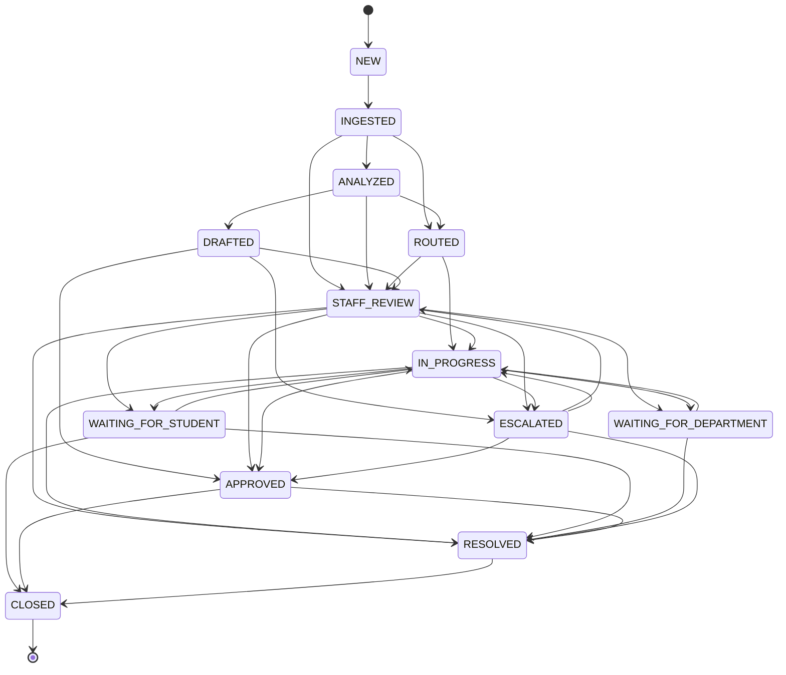

# Smart RMS Canonical Data Contract & Domain Model

## 1. Architectural Strategy & Guarantees

Smart RMS is designed as an enterprise university operations platform with a strict boundary between the core reasoning/workflow engine and external university administrative data sources (UMS/RMS/SIS).

```
┌────────────────────────────────────────────────────────┐
│               Mock University Environment              │
│ (Synthetic Records, SLA Policies, Departments, Users)  │
└───────────────────────────┬────────────────────────────┘
                            │  implements
                            ▼
┌────────────────────────────────────────────────────────┐
│             Stable Data Contract Boundary              │
│       UniversitySystemAdapter & Domain Entities        │
└───────────────────────────┬────────────────────────────┘
                            │  consumed by
                            ▼
┌────────────────────────────────────────────────────────┐
│                     Smart RMS Core                     │
│    (AI Pipeline, Privacy Masker, RAG, Workflow Engine) │
└───────────────────────────▲────────────────────────────┘
                            │  consumed by
                            │  (Future Milestone)
┌────────────────────────────────────────────────────────┐
│             Real University UMS/RMS Gateway            │
│         FutureUMSAdapter (Swappable Implementation)    │
└────────────────────────────────────────────────────────┘
```

When approved live university data sources become available, only the concrete adapter implementation (`UniversitySystemAdapter`) is replaced. The Smart RMS Core domain logic, AI pipelines, and workflows remain completely untouched.

---

## 2. Core Domain Entities

The canonical contract defines twelve strongly typed domain models in `app/schemas/contracts.py`:

| # | Domain Entity | Primary Purpose | Key Fields |
|---|---------------|-----------------|------------|
| 1 | **RMSRequest** | Canonical student grievance request | `ticket_id`, `external_reference`, `student_reference`, `title`, `description`, `category`, `subcategory`, `department`, `priority`, `status`, `due_at`, `sla_record`, `assigned_staff_id`, `assigned_department_id`, `tags`, `responses`, `history`, `is_synthetic` |
| 2 | **StudentReference** | Synthetic student identity | `student_id`, `registration_number`, `name`, `program`, `semester`, `hostel_block`, `room_number`, `email`, `phone`, `is_synthetic` |
| 3 | **Department** | Administrative university unit | `department_id`, `department_code`, `name`, `description`, `categories`, `sla_policy`, `escalation_policy`, `staff_ids`, `hod_reference`, `active_status` |
| 4 | **StaffUser** | Synthetic staff operator persona | `user_id`, `display_name`, `email`, `role`, `department_id`, `permissions`, `active_status`, `workload_metadata` |
| 5 | **DepartmentSLAPolicy**| Per-priority resolution targets | `LOW` (hrs), `MEDIUM` (hrs), `HIGH` (hrs), `CRITICAL` (hrs) |
| 6 | **SLARecord** | Active SLA metrics and status | `priority`, `sla_hours`, `due_at`, `is_breached`, `remaining_hours`, `status` (`ON_TRACK`, `AT_RISK`, `BREACHED`) |
| 7 | **Assignment** | Ticket routing assignment | `assignment_id`, `ticket_id`, `department_id`, `staff_id`, `assigned_by`, `assigned_at`, `reason`, `active` |
| 8 | **RMSResponse** | Communication thread message | `response_id`, `ticket_id`, `author_id`, `author_name`, `author_role`, `content`, `is_internal`, `created_at` |
| 9 | **Escalation** | Departmental escalation record | `escalation_id`, `ticket_id`, `escalated_by`, `target_role`, `reason`, `urgent`, `escalated_at`, `status` |
| 10 | **AuditEvent** | Immutable compliance audit record | `event_id`, `ticket_id`, `event_type`, `actor_id`, `actor_role`, `timestamp`, `from_state`, `to_state`, `notes`, `details` |
| 11 | **AttachmentMetadata**| Associated document/evidence | `attachment_id`, `filename`, `file_size_bytes`, `content_type`, `url`, `uploaded_at` |
| 12 | **KnowledgeDocument**| Grounding policy text | `document_id`, `title`, `department`, `clause`, `content`, `effective_date`, `keywords`, `version`, `is_active` |

---

## 3. Canonical Lifecycle & State Machine

The ticket lifecycle follows an audited state machine enforced by `WorkflowEngine`:



### State Definitions:
- `NEW`: Ingested ticket payload before initial persistence.
- `INGESTED`: Ticket stored in university gateway.
- `ANALYZED`: AI NLP pipeline has executed triage, categorization, and confidence scoring.
- `ROUTED`: Dispatched to specific department based on classification.
- `STAFF_REVIEW`: Pending human-in-the-loop review in the Staff Copilot.
- `IN_PROGRESS`: Actively investigated or serviced by departmental operator.
- `WAITING_FOR_STUDENT`: Pending student clarification, receipts, or documents.
- `WAITING_FOR_DEPARTMENT`: Cross-departmental consultation (e.g. Accounts waiting on Hostel).
- `ESCALATED`: Escalated to Department HOD or Dean due to complexity or SLA risk.
- `APPROVED`: Resolution text approved by human staff operator.
- `RESOLVED`: Official resolution dispatched back to student.
- `CLOSED`: Complete lifecycle termination.

---

## 4. Priority & SLA Model

Departmental SLA policies define resolution windows based on priority level:

```python
class DepartmentSLAPolicy(BaseModel):
    LOW: int = 72       # Informational queries, non-urgent certificates
    MEDIUM: int = 48    # Routine discrepancies, grade validations
    HIGH: int = 24      # Urgent repairs, scholarship verifications
    CRITICAL: int = 12  # Exam admit card holds, emergency electrical hazards
```

### Department Baseline Policies:
- **Hostel Affairs (`DEPT-HOSTEL`)**: Low: 48h, Medium: 24h, High: 12h, Critical: 4h
- **Accounts & Finance (`DEPT-ACCOUNTS`)**: Low: 72h, Medium: 48h, High: 24h, Critical: 12h
- **Academic Affairs (`DEPT-ACADEMICS`)**: Low: 72h, Medium: 48h, High: 24h, Critical: 8h
- **Examination Branch (`DEPT-EXAM`)**: Low: 48h, Medium: 24h, High: 12h, Critical: 4h
- **Student Welfare (`DEPT-WELFARE`)**: Low: 72h, Medium: 36h, High: 18h, Critical: 6h
- **Scholarship Section (`DEPT-SCHOLARSHIP`)**: Low: 96h, Medium: 72h, High: 36h, Critical: 12h
- **IT Services (`DEPT-IT`)**: Low: 48h, Medium: 24h, High: 8h, Critical: 2h

---

## 5. Stable Adapter Contract (`UniversitySystemAdapter`)

```python
class UniversitySystemAdapter(ABC):
    @abstractmethod
    def fetch_tickets(self, department=None, priority=None, status=None, search=None) -> List[Dict[str, Any]]: ...
    @abstractmethod
    def get_ticket_by_id(self, ticket_id: str) -> Optional[Dict[str, Any]]: ...
    @abstractmethod
    def create_ticket(self, ticket_data: Dict[str, Any]) -> Dict[str, Any]: ...
    @abstractmethod
    def update_ticket(self, ticket_id: str, updates: Dict[str, Any]) -> bool: ...
    @abstractmethod
    def assign_ticket(self, ticket_id: str, department_id: Optional[str], staff_id: Optional[str], assigned_by: str, reason: Optional[str] = None) -> bool: ...
    @abstractmethod
    def add_response(self, ticket_id: str, response_data: Dict[str, Any]) -> Dict[str, Any]: ...
    @abstractmethod
    def post_resolution(self, ticket_id: str, resolution_text: str, staff_id: str) -> bool: ...
    @abstractmethod
    def get_audit_history(self, ticket_id: str) -> List[Dict[str, Any]]: ...
    @abstractmethod
    def list_departments(self) -> List[Dict[str, Any]]: ...
    @abstractmethod
    def get_department(self, department_id: str) -> Optional[Dict[str, Any]]: ...
    @abstractmethod
    def list_users(self, department_id: Optional[str] = None, role: Optional[str] = None) -> List[Dict[str, Any]]: ...
    @abstractmethod
    def get_user(self, user_id: str) -> Optional[Dict[str, Any]]: ...
    @abstractmethod
    def get_student_context(self, student_reference: str) -> Optional[Dict[str, Any]]: ...
```
