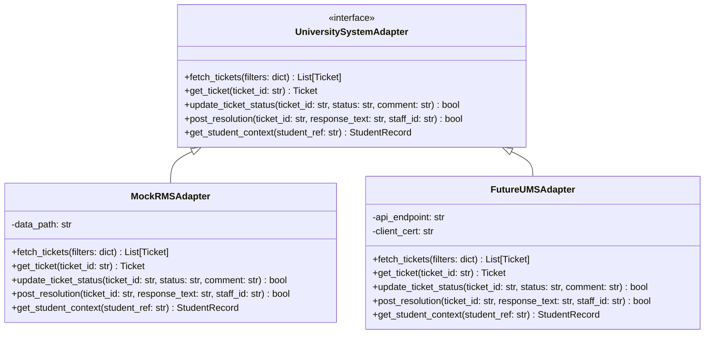

# Integration Architecture: University Systems

## 1. Architectural Strategy

Universities typically rely on heterogeneous legacy or proprietary systems (e.g., LPU UMS, Student Information Systems, Learning Management Systems, Attendance Gate Scanners, ERPs).

Direct hard-coded dependencies on proprietary APIs violate software maintainability and prevent development in sandbox environments.

Smart RMS solves this with an **Adapter Pattern**:
- The core platform depends solely on a formal contract: `UniversitySystemAdapter`.
- During development and initial evaluation, all calls are routed to high-fidelity **Mock Adapters** generating realistic synthetic data.
- When university IT or Infotech teams provision staging API gateways, specialized adapters (`FutureUMSAdapter`, `FutureERPAdapter`) can be enabled without modifying any core AI, triage, or workflow logic.

---

## 2. Adapter Class Hierarchy

```
UniversitySystemAdapter (Abstract Base Class)
    │
    ├── MockRMSAdapter              (Active in Dev - Serves synthetic data)
    ├── FutureUMSAdapter            (Planned - LPU UMS/RMS Gateway)
    ├── FutureSISAdapter            (Planned - Student Information System)
    ├── FutureLMSAdapter            (Planned - Moodle / Blackboard / CMS)
    ├── FutureERPAdapter            (Planned - SAP / Oracle Student Financials)
    ├── FutureHostelAdapter         (Planned - Biometrics & Warden Portals)
    └── FutureAttendanceAdapter     (Planned - RFID / Biometric Turnstiles)
```



---

## 3. Subsystem Integration Scenarios

### 3.1. LPU UMS / RMS (Grievance Ingestion & Status Sync)
- **Direction:** Bi-directional.
- **Ingestion:** Webhook or polling mechanism fetching newly submitted RMS tickets.
- **Sync:** When staff approve a resolution draft in Smart RMS, the approved text and closure code are pushed back to UMS to close the ticket in the student view.

### 3.2. Student Information System (SIS) Context
- **Purpose:** Provide staff with non-PII academic context (e.g., student semester, program, cumulative attendance %) to verify claims made in grievances without asking the student to re-submit proof.
- **Privacy:** Information is pulled just-in-time and never retained in vector stores.

### 3.3. LMS (Learning Management System)
- **Purpose:** Verify continuous assessment (CA) submission timestamps, quiz access logs, and teacher feedback for academic grade grievances.

### 3.4. ERP & Accounts
- **Purpose:** Query fee ledger balances, refund processing status, and payment gateway transaction references for fee-related tickets.

### 3.5. Hostel & Warden Portal
- **Purpose:** Cross-reference room allocation, maintenance work orders, warden night pass approvals, and mess feedback.

### 3.6. Attendance System
- **Purpose:** Medical leave grievances require validating biometric punch records on specific dates against medical hospital admission slips.

---

## 4. Configuration & Switchover

Integration mode is configured cleanly in `.env`:
```ini
# Options: mock, ums_staging, production
INTEGRATION_MODE=mock
UMS_GATEWAY_URL=https://staging.ums.university.internal/api/v2
UMS_CLIENT_ID=smart_rms_staging_client
UMS_CLIENT_SECRET=vault_secret_key
```

Factory instantiation in backend:
```python
def get_system_adapter(settings: Settings) -> UniversitySystemAdapter:
    if settings.INTEGRATION_MODE == "ums_staging":
        return FutureUMSAdapter(settings)
    return MockRMSAdapter(settings)
```
This guarantees 100% stability in development and zero risk of breaking local runs when testing.
