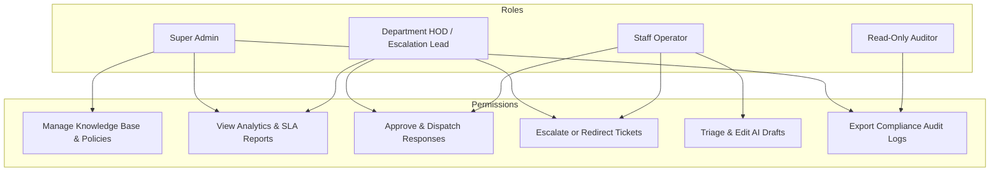

# Privacy & Security Architecture

## 1. Core Principles

University relationship management systems process confidential student and institutional data. Smart RMS adheres to the highest data protection standards:

1. **Synthetic Data Exclusivity in Development:** Absolute ban on real student records during testing and development.
2. **Privacy by Design:** Automated PII masking before text reaches vector databases or external LLM APIs.
3. **Zero Autonomous Irreversible Actions:** All official university communications require verified human approval.
4. **No-Source-No-Answer Guardrail:** The model will never guess an answer without supporting approved policy documentation.
5. **Role-Based Access Control (RBAC):** Strict boundary isolation between departments and user roles.

---

## 2. Privacy & PII Handling

### 2.1. PII Categories & Redaction Rules

| PII Category | Pattern / Detection Method | Redacted Token | Replacement Strategy |
|---|---|---|---|
| **Phone Number** | International & domestic mobile patterns (`+91`, `10-digit`) | `[REDACTED_PHONE]` | Mask with placeholder |
| **Registration Number** | Academic ID formats (e.g., `1220XXXX`, `REG-202X-XXXX`) | `[REDACTED_REG_NO]` | Reversible token hash |
| **Email Address** | Regex RFC 5322 compliance (`*@*.lpu.in`, `*@gmail.com`) | `[REDACTED_EMAIL]` | Mask with placeholder |
| **National ID / Aadhaar** | 12-digit numeric sequences & passport formats | `[REDACTED_ID]` | Mask with placeholder |
| **Financial Identifiers** | Bank accounts, UPI IDs, Transaction reference numbers | `[REDACTED_TXN_ID]` | Mask with placeholder |

### 2.2. Reversible Session Vault
For operational efficiency, staff handling a ticket may need to know who the student is to verify records in university ERP.
- Redaction occurs at the **AI pipeline perimeter**.
- Original values are held in an ephemeral, encrypted in-memory session vault accessible only to authorized staff viewing the ticket.
- Redacted text is the **only text sent to vector databases, external AI providers, or analytics logs**.

---

## 3. Role-Based Access Control (RBAC)

Smart RMS implements fine-grained permissions:



### Role Matrix

| Capability | Staff Operator | Department HOD | System Admin | Auditor |
|---|:---:|:---:|:---:|:---:|
| View Assigned Dept Queue | ✅ | ✅ | ✅ | ✅ |
| View Other Dept Queues | ❌ | ❌ (Unless Escalated) | ✅ | ✅ |
| Trigger AI Triage / Draft | ✅ | ✅ | ✅ | ❌ |
| Edit Draft Response | ✅ | ✅ | ❌ | ❌ |
| Approve & Send Response | ✅ | ✅ | ❌ | ❌ |
| Escalate Ticket to HOD | ✅ | ✅ | ❌ | ❌ |
| Upload / Approve RAG Docs | ❌ | ✅ (Dept Only) | ✅ (Global) | ❌ |
| Download Audit Logs | ❌ | ❌ | ✅ | ✅ |

---

## 4. Encryption & Infrastructure Expectations

- **In-Transit:** All HTTP communications must use TLS 1.3. Plain HTTP is rejected outside local development environments.
- **At-Rest:** 
  - PostgreSQL database volumes encrypted using AES-256.
  - Chroma vector data directories encrypted on host volumes.
  - Redis cache keys encrypted with TTL expiration (default 24h).
- **Secrets Management:** Zero secrets stored in source code. All tokens, database credentials, and API keys are injected via environment variables or cloud secret managers.

---

## 5. Audit Logging & Compliance

Every action within Smart RMS generates an immutable audit record:

```json
{
  "event_id": "AUDIT-2026-0921-9982",
  "timestamp": "2026-09-21T09:44:00Z",
  "ticket_id": "RMS-TKT-2024-001",
  "actor_id": "USER-STAFF-104",
  "actor_role": "STAFF_OPERATOR",
  "action": "DRAFT_APPROVED",
  "details": {
    "original_ai_draft_hash": "a1b2c3d4...",
    "final_approved_text_hash": "e5f6g7h8...",
    "was_edited": true,
    "edit_distance_chars": 42,
    "policy_cited": "DOC-2024-HOSTEL-01#Clause4.2",
    "ai_confidence_score": 0.94
  },
  "ip_address": "10.0.4.12",
  "signature": "hmac_sha256_verified"
}
```

---

## 6. Secure Integration Boundaries

When integrating with university core systems (UMS, SIS, ERP):
- Smart RMS communicates strictly over authenticated private VPC links or mTLS endpoints.
- No direct database writes to production UMS tables; all actions occur via idempotent REST/gRPC adapters with request rate limiting.
- The system supports zero-trust webhook authentication using HMAC-SHA256 signature verification.
