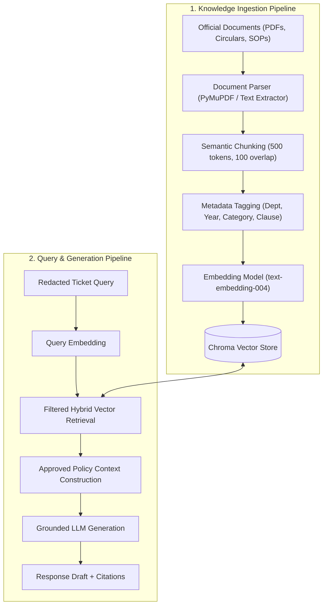

# RAG (Retrieval-Augmented Generation) Architecture

## 1. Core Principle: Approved University Knowledge Only

In an academic institution, generating inaccurate or speculative information regarding grade policies, fee refunds, disciplinary actions, or attendance thresholds can result in severe administrative or legal complications.

Therefore, Smart RMS enforces a strict RAG policy:
> **Zero Unverified Knowledge:**  
> Smart RMS shall only retrieve and generate responses from **officially vetted, approved university knowledge bases**. Web search, general LLM parametric memory for university rules, and unverified documents are strictly prohibited for official resolution drafts.

---

## 2. Ingestion & Retrieval Pipeline



---

## 3. Step-by-Step Architecture

### 3.1. Document Ingestion
- **Document Types:**
  - University Academic Regulations & By-laws.
  - Examination Manuals & Re-evaluation Guidelines.
  - Hostel Rules, Curfew Timings & Maintenance Procedures.
  - Fee Refund & Scholarship Policies.
  - Student Welfare Grievance SOPs.
- **Access Control:** Documents must be digitally signed or uploaded via an authenticated Admin portal with approval status: `STATUS = APPROVED_FOR_RAG`.

### 3.2. Document Parsing
- **Engine:** PyMuPDF (`fitz`) for PDF documents with fallback to Tesseract OCR for scanned circulars.
- **Structure Extraction:** Preserves header hierarchies (`H1`, `H2`, `Clause 3.1.4`) so that individual rules retain their legal/academic context.

### 3.3. Chunking Strategy
- **Chunk Size:** 400–600 tokens (~1,500 characters).
- **Chunk Overlap:** 100 tokens to prevent contextual clipping at section boundaries.
- **Chunk Integrity:** Chunks do not split across distinct numerical clauses when possible.

### 3.4. Metadata Schema
Every chunk indexed in the vector store carries mandatory metadata:
```json
{
  "document_id": "DOC-2024-HOSTEL-01",
  "document_title": "Hostel Code of Conduct & Maintenance Regulations 2024",
  "department": "Hostel Affairs",
  "effective_date": "2024-01-01",
  "expiry_date": "2025-06-30",
  "clause_reference": "Section 4, Clause 4.2 (Electrical & Appliance Repair)",
  "approval_authority": "Chief Warden Office",
  "is_active": true
}
```

### 3.5. Embeddings
- **Model:** Configurable embedding layer. Default: `text-embedding-004` (Google) / compatible open-source embeddings (`all-MiniLM-L6-v2` in mock/offline mode).
- **Dimension:** Standard 768 / 384 dimensions normalized for cosine similarity.

### 3.6. Vector Database (Chroma)
- **Local / Containerized:** Chroma vector database embedded in development, with production support for hosted Chroma, Pgvector, or Milvus.
- **Collection Partitioning:** Separate collections per operational domain (e.g., `rms_academics`, `rms_hostel`, `rms_finance`).

### 3.7. Retrieval Engine
- **Strategy:** Top-$K$ similarity search ($K=3$) with cosine threshold $\ge 0.72$.
- **Pre-filtering:** Metadata filtering by the ticket's predicted department to eliminate cross-domain false positives (e.g., ensuring a Hostel query never retrieves Exam rules).

### 3.8. Prompt Context Injection
The retrieved chunks are assembled into a structured system context:
```markdown
You are an AI Copilot for University RMS Staff.
Your task is to write a grounded draft response based EXCLUSIVELY on the university policy excerpts below.

=== APPROVED UNIVERSITY POLICIES ===
[1] Document: Hostel Code of Conduct 2024 | Clause 4.2
"Maintenance requests for electrical and sanitary issues must be inspected by the maintenance supervisor within 24 hours of ticket submission. If parts replacement is needed, resolution window is 48 hours."

[2] Document: Hostel Code of Conduct 2024 | Clause 4.3
"Emergency complaints (water leakage, power outage) have a priority resolution window of 4 hours."
=== END OF POLICIES ===

RULES:
- Cite the source document and clause reference for every statement.
- If the policy does not cover the question, state: "Policy details not found in verified documents."
- Never invent deadlines, penalties, or approval criteria.
```

### 3.9. Grounded Generation & Source References
- The generated draft includes explicit source references:
  - Source Name: *Hostel Code of Conduct 2024*
  - Clause: *Section 4, Clause 4.2*
  - Confidence Score: *0.94*
- Staff members can click any citation on the Copilot Dashboard to inspect the verbatim policy text.
