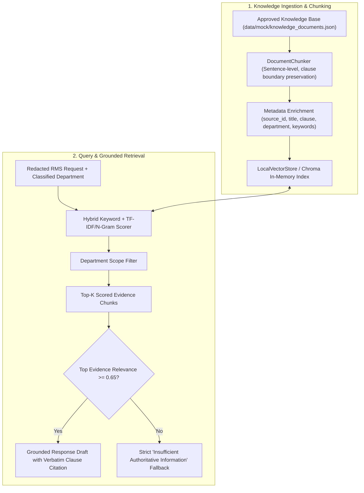

# RAG (Retrieval-Augmented Generation) Architecture — Smart RMS Phase 2

## 1. Core Principle: Authoritative Knowledge & No-Source-No-Answer

In an academic and university operations setting, hallucinating or fabricating policy clauses regarding fee refunds, attendance thresholds, or admit card clearance leads to severe administrative complications.

Smart RMS strictly enforces:
> **1. Policy-Constrained Grounded Generation:**  
> Smart RMS drafts responses *solely* from approved university regulatory documents.
>
> **2. Strict No-Source-No-Answer Fallback:**  
> If no authoritative source achieves the relevance threshold ($\ge 0.65$), the system **refuses to guess or fabricate**. Instead, it generates:
> *"Insufficient authoritative information. Human review required."* and prompts human staff triage.

---

## 2. Ingestion & Retrieval Pipeline

```mermaid
flowchart TD
    subgraph Ingestion["1. Knowledge Ingestion & Chunking"]
        Raw["Approved Knowledge Base (data/mock/knowledge_documents.json)"]
        Chunker["DocumentChunker (Sentence-level, clause boundary preservation)"]
        Meta["Metadata Enrichment (source_id, title, clause, department, keywords)"]
        Index["LocalVectorStore / Chroma In-Memory Index"]
        Raw --> Chunker --> Meta --> Index
    end

    subgraph QueryPipeline["2. Query & Grounded Retrieval"]
        Query["Redacted RMS Request + Classified Department"]
        Matcher["Hybrid Keyword + TF-IDF/N-Gram Scorer"]
        Filter["Department Scope Filter"]
        TopK["Top-K Scored Evidence Chunks"]
        Guard{"Top Evidence Relevance >= 0.65?"}
        Draft["Grounded Response Draft with Verbatim Clause Citation"]
        Fallback["Strict 'Insufficient Authoritative Information' Fallback"]

        Query --> Matcher --> Filter --> TopK --> Guard
        Index <--> Matcher
        Guard -- Yes --> Draft
        Guard -- No --> Fallback
    end
```

---

## 3. RAG Result Contract (Section 13 Compliance)

Every retrieved source item implements the Phase 2 contract:

| Field Name | Type | Description |
| :--- | :--- | :--- |
| `source_id` / `document_id` | `string` | Unique identifier (e.g., `DOC-2024-HOSTEL-01`). |
| `document_name` / `title` | `string` | Human-readable document name (e.g., `Hostel Regulations 2024`). |
| `section` / `clause` | `string` | Statutory clause reference (e.g., `Section 4, Clause 4.2`). |
| `relevance_score` | `float` | Scored similarity metric $\in [0.0, 1.0]$. |
| `excerpt` | `string` | Verbatim text chunk used as evidence. |

---

## 4. Current Implementation vs Future Production Architecture

| Component | Current Phase 2 Implementation | Future Production Milestone |
| :--- | :--- | :--- |
| **Vector Store** | `LocalVectorStore` with sentence chunking and in-memory TF-IDF/n-gram indexing. | Persistent Chroma / Qdrant vector database with HNSW dense vector index. |
| **Embeddings** | Subword character 3-gram cosine + token overlap with synonym expansion. | Dense 768-dim embeddings (`text-embedding-004` or `all-MiniLM-L6-v2`). |
| **Chunking** | `DocumentChunker` segmenting by sentences (~60 words) preserving clause headers. | Recursive character text splitter with semantic sentence boundary detection. |
| **Re-ranking** | Deterministic keyword + department bonus score sorting. | Cross-encoder neural re-ranker (e.g., `bge-reranker-large`). |
| **Execution** | Pure Python, offline, zero API keys required for development or CI. | Distributed microservice cluster with asynchronous vector updates. |

---

## 5. Grounding & Hallucination Guardrails

1. **Explicit Citation**: The generated draft must cite the exact document title and clause.
2. **Policy Verbatim Echoing**: The draft includes a quote from the retrieved excerpt for staff verification.
3. **No Autonomous Commitments**: Evaluated by `PolicyValidator` to block unauthorized guarantees (e.g., "100% pass guarantee", "automatic full fee waiver").
4. **Staff Override**: Every draft is presented in the Staff Copilot workstation as an editable suggestion before dispatch.
