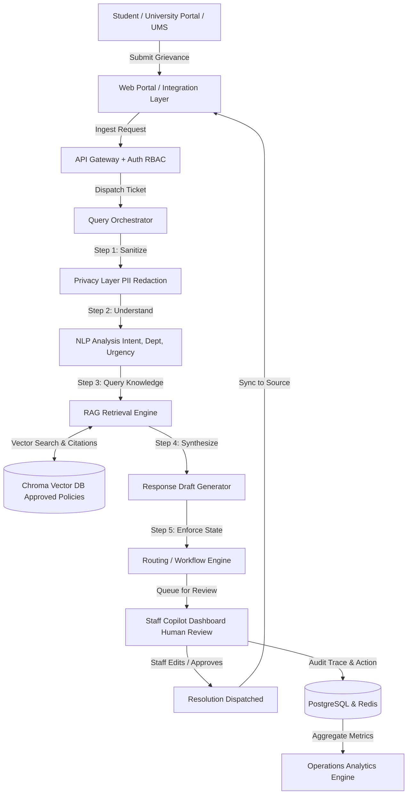

# System Architecture: Smart RMS

## 1. Overview

Smart RMS is architected as an **AI-assisted operations copilot** designed specifically for university administrators and staff who triage, investigate, and resolve thousands of relationship management system (RMS) grievances.

The platform sits between the raw influx of student inquiries (received via university portals or future UMS integration adapters) and the administrative staff tasked with resolving them. It transforms unstructured queries into grounded, policy-compliant, evidence-backed draft responses while keeping **humans firmly in the loop**.

---

## 2. End-to-End System Flow

---

## 3. Component Breakdown

### 3.1. User / UMS
- **Source of Inquiries:** Students, parents, and scholars submitting grievances across categories (Hostel, Academics, Finance, Examination, etc.).
- **Initial Mode:** In development, inquiries originate from realistic synthetic test fixtures. In production, this interfaces with university portals.

### 3.2. Web Portal / Integration Layer
- **Interface:** Pluggable adapter abstraction (`UniversitySystemAdapter`).
- **Role:** Translates external payloads (UMS ticket formats, ERP hooks) into normalized Smart RMS ticket schemas.
- **Safety:** Ensures external failures do not bring down internal triage pipelines.

### 3.3. API Gateway + Auth (RBAC)
- **Framework:** FastAPI with asynchronous ASGI execution.
- **Authentication:** Bearer token / mock auth headers in development, designed for Keycloak or university SSO (SAML/OAuth2) integration.
- **Authorization:** Role-Based Access Control (RBAC) segregating Staff Operators, Department HODs, and Super Admins.

### 3.4. Query Orchestrator
- **Role:** Coordinates the execution pipeline across privacy, NLP, RAG, and workflow services.
- **Fault Tolerance:** If external LLM calls time out or fail, the orchestrator gracefully degrades to fallback responses and notifies staff of low-confidence status.

### 3.5. Privacy Layer (PII Detection & Redaction)
- **Role:** Sanitizes personal identifiable information before any text is processed by LLM engines or stored in vector contexts.
- **Capabilities:**
  - Redaction of phone numbers, student registration numbers, email addresses, and personal identification tokens.
  - Reversible token mapping stored securely in the local session for staff re-hydration if authorized.

### 3.6. NLP Analysis
- **Role:** Deep semantic extraction of incoming text.
- **Outputs:**
  - Primary Intent (e.g., `REQUEST_REFUND`, `GRADE_RECHECK_APPLICATION`, `ROOM_MAINTENANCE`).
  - Target Department (e.g., `ACCOUNTS`, `EXAMINATION`, `HOSTEL_AFFAIRS`).
  - Priority & Urgency Score (1 to 5) determined by keyword triggers, SLA proximity, and emotional distress markers.

### 3.7. RAG (Retrieval-Augmented Generation) Engine
- **Role:** Grounded knowledge retrieval restricted strictly to official university documents.
- **Components:**
  - Document chunking with semantic overlap.
  - Chroma vector store with metadata filtering (e.g., filter only by `academic_year: 2024` or `department: Hostel`).
  - Relevance ranking and citation packaging (Article, Clause, Document Name).

### 3.8. Routing / Workflow Engine
- **Role:** State machine managing ticket transitions.
- **States:**
  - `INGESTED` → `ANALYZED` → `DRAFTED` → `STAFF_REVIEW` → `APPROVED` / `ESCALATED` / `REDIRECTED` → `RESOLVED`.
- **Integrity:** Enforces that no ticket can transition to `RESOLVED` without a verified staff approval signature.

### 3.9. Response Draft Generator
- **Role:** Generates an official, polite, and policy-aligned draft response.
- **Grounding Rule:** If the retrieved RAG context does not contain sufficient verified policy evidence, the system produces an uncertainty warning: `"Policy guidance not found. Staff manual verification required."`

### 3.10. Human Review (Staff Copilot Dashboard)
- **Role:** Frontline interface for administrative staff.
- **Experience:**
  - Displays original ticket alongside redacted text.
  - Highlights AI detected intent, recommended routing, and priority.
  - Presents cited policy articles with one-click full text preview.
  - Provides rich text editor allowing staff to adjust tone, add specific details, or completely rewrite the draft.
  - Actions: **Approve & Send**, **Escalate to HOD**, **Redirect Department**, **Reject Draft**.

### 3.11. Resolution Dispatcher
- **Role:** Upon staff approval, formats the final response and transmits it back through the integration layer to the student.
- **Immutability:** Creates an append-only audit trail logging who approved it, what was edited, and which policy version was cited.

### 3.12. Operations Analytics Engine
- **Role:** Continuous operational intelligence for university leadership.
- **Metrics Tracked:**
  - Ticket volume per department.
  - AI draft acceptance rate without edits vs. edited percentage.
  - Average time to triage and time to resolution.
  - Most frequently cited university policies (identifying ambiguous university circulars).
