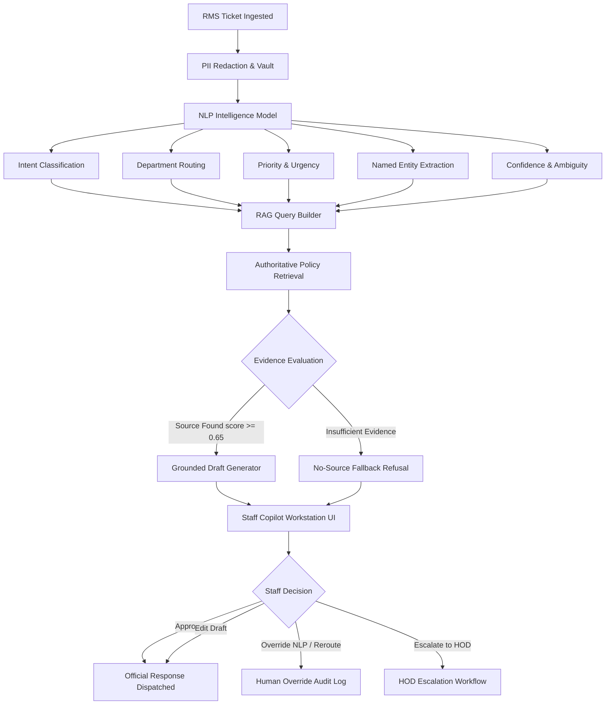

# Staff Copilot Architecture — Smart RMS (Milestone 5)

## 1. System Vision & Core Principle

Smart RMS Staff Copilot transforms university RMS tickets into an AI-assisted operational workflow:

> **AI ASSISTS. HUMANS DECIDE.**

The AI Copilot operates exclusively as a decision-support workstation for university staff officers. It automates ingestion triage, entity extraction, policy retrieval, and grounded response drafting—while strictly reserving final decision-making, official communication dispatch, and workflow status transitions to human staff.

---

## 2. End-to-End Pipeline Workflow

---

## 3. Subsystem Breakdown

### 1. PII Redactor
- **Function**: Masks student registration numbers, phone numbers, email addresses, CGPA records, and financial amounts prior to AI analysis or RAG query generation.
- **Safety**: Unmasked student data never enters the NLP or LLM inference pipeline.

### 2. NLP Intelligence Engine
- **Configurable Providers**:
  - `MODEL_PROVIDER=deterministic` (Rule-based pattern matcher)
  - `MODEL_PROVIDER=tfidf_logistic` (TF-IDF + Logistic Regression)
  - `MODEL_PROVIDER=tfidf_svm` (TF-IDF + Calibrated Linear SVM — recommended)
  - `MODEL_PROVIDER=sentence_transformer` (Dense embeddings + Classifier)
- **Outputs**: Canonical intent, recommended department, priority level (Critical, High, Medium, Low), urgency tier (Immediate, Urgent, Normal, Low), extracted entities (course codes, hostel blocks, room numbers, amounts, dates).

### 3. Policy Retrieval (RAG)
- Retrieves relevant university policy clauses and operational handbook sections using semantic search.
- Computes cosine similarity relevance scores ($0.00$ to $1.00$).

### 4. Grounded Draft Generator
- **Grounded Draft (Relevance $\ge 0.65$)**: Generates an authoritative response template explicitly citing the document title, clause number, and policy excerpt.
- **No-Source Refusal (Relevance $< 0.65$)**: Generates `"Insufficient authoritative information. Human review required."` and enforces manual staff review.

### 5. Staff Workstation Controls
- **Approve**: Finalizes and dispatches the draft as an official response.
- **Edit**: Allows staff to revise the AI draft before dispatch.
- **Override**: Permits staff to correct department routing, priority, urgency, or intent.
- **Escalate**: Elevates complex or sensitive grievances to Department HOD.
- **Redirect**: Forwards misrouted requests to the appropriate operational unit.
