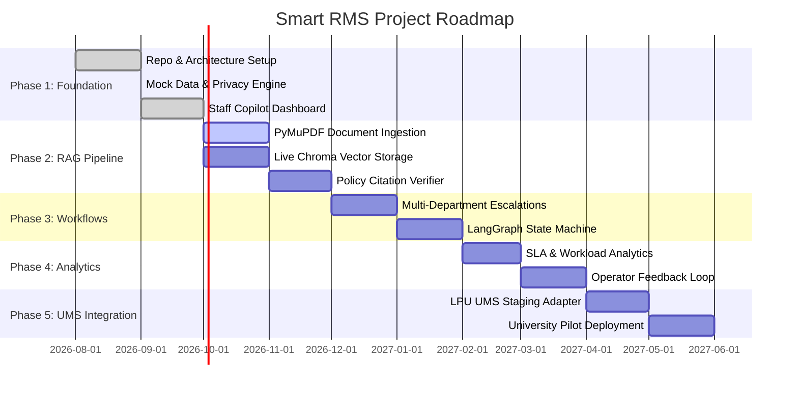

# Product Roadmap: Smart RMS

## Delivery Phases

---

## Detailed Milestones

### Phase 1: Foundation & Architecture (Current)
- [x] Full architectural blueprint and documentation suite.
- [x] Standardized synthetic dataset across 8 university departments.
- [x] PII detection and redaction engine for student records.
- [x] Abstract AI and Vector Store providers (`MockAIProvider`, `MockVectorStore`).
- [x] FastAPI REST API with core endpoints (`/health`, `/rms`, `/analyze`, `/draft`, `/approve`).
- [x] Staff Copilot Dashboard (React, TypeScript, Vite, Tailwind).
- [x] University system adapter specification (`MockRMSAdapter`).

### Phase 2: RAG Pipeline & Document Parsing (Q4 2026)
- Integration of PyMuPDF (`fitz`) and OCR for university PDF circulars.
- Implementation of semantic chunking with clause-boundary preservation.
- Live indexing into containerized Chroma vector store.
- Re-ranking layer (BM25 + Dense embeddings) for high-precision retrieval.

### Phase 3: Complex Workflows & Human Escalations (Q1 2027)
- Multi-tier escalation pathways (Operator → Senior Officer → HOD → Dean).
- LangGraph-based workflow engine for multi-step dispute resolutions.
- Notification triggers for SLA breaches and urgent health/safety grievances.

### Phase 4: Operational Analytics & Learning Loop (Q1-Q2 2027)
- Analytics dashboards monitoring department volume, draft edit distance, and acceptance rate.
- Active learning pipeline: logging staff edits to refine prompt templates and knowledge base gaps.
- Automated anomaly detection for sudden spikes in specific grievance categories.

### Phase 5: LPU UMS Staging & Pilot Deployment (Q2 2027)
- Implement `FutureUMSAdapter` connecting to university staging test bed.
- Security audit and penetration testing with Infotech team.
- Departmental pilot with Academic Affairs and Hostel Warden offices.
