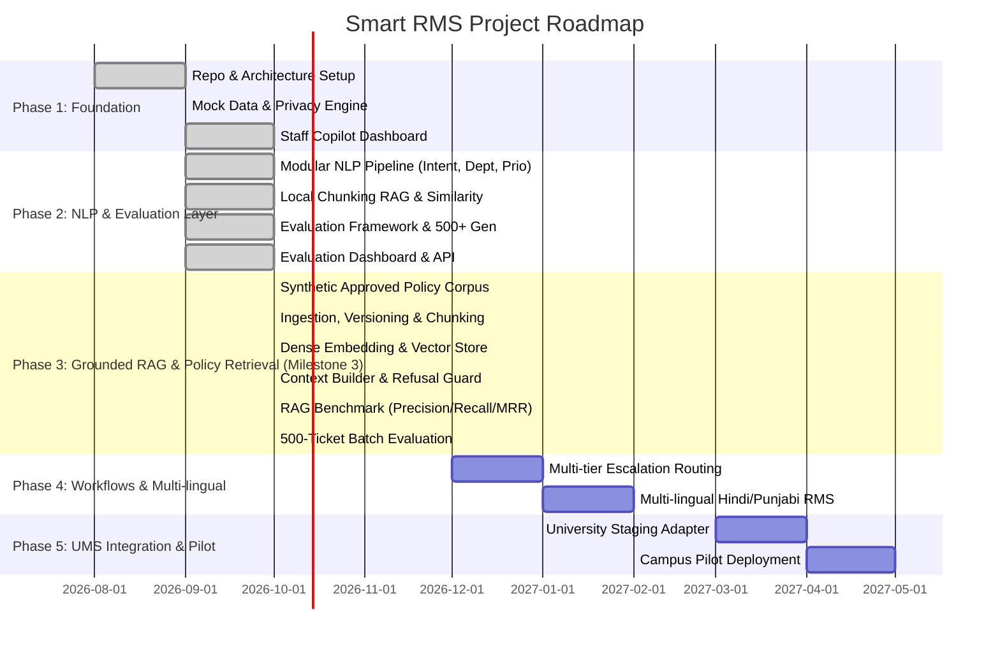

# Product Roadmap: Smart RMS

## Delivery Phases

```mermaid
gantt
    title Smart RMS Project Roadmap
    dateFormat  YYYY-MM
    section Phase 1: Foundation
    Repo & Architecture Setup        :done, p1a, 2026-08, 2026-09
    Mock Data & Privacy Engine       :done, p1b, 2026-09, 2026-09
    Staff Copilot Dashboard          :done, p1c, 2026-09, 2026-10
    section Phase 2: NLP & Evaluation Layer
    Modular NLP Pipeline (Intent, Dept, Prio) :done, p2a, 2026-09, 2026-10
    Local Chunking RAG & Similarity :done, p2b, 2026-09, 2026-10
    Evaluation Framework & 500+ Gen  :done, p2c, 2026-09, 2026-10
    Evaluation Dashboard & API       :done, p2d, 2026-09, 2026-10
    section Phase 3: Grounded RAG & Policy Retrieval (Milestone 3)
    Synthetic Approved Policy Corpus :done, p3a, 2026-10, 2026-10
    Ingestion, Versioning & Chunking :done, p3b, 2026-10, 2026-10
    Dense Embedding & Vector Store   :done, p3c, 2026-10, 2026-10
    Context Builder & Refusal Guard  :done, p3d, 2026-10, 2026-10
    RAG Benchmark (Precision/Recall/MRR) :done, p3e, 2026-10, 2026-10
    500-Ticket Batch Evaluation      :done, p3f, 2026-10, 2026-10
    section Phase 4: Workflows & Multi-lingual
    Multi-tier Escalation Routing    :p4a, 2026-12, 2027-01
    Multi-lingual Hindi/Punjabi RMS  :p4b, 2027-01, 2027-02
    section Phase 5: UMS Integration & Pilot
    University Staging Adapter       :p5a, 2027-03, 2027-04
    Campus Pilot Deployment          :p5b, 2027-04, 2027-05
```

---

## Detailed Milestones

### Phase 1: Foundation & Architecture (COMPLETED)
- [x] Full architectural blueprint and documentation suite.
- [x] Standardized synthetic dataset across university departments.
- [x] PII detection and redaction engine for student records.
- [x] Abstract AI and Vector Store providers (`MockAIProvider`, `MockVectorStore`).
- [x] FastAPI REST API with core endpoints (`/health`, `/rms`, `/analyze`, `/draft`, `/approve`).
- [x] Staff Copilot Dashboard (React, TypeScript, Vite, Tailwind).
- [x] University system adapter specification (`MockRMSAdapter`).

### Phase 2: Real NLP & Evaluation Layer (COMPLETED)
- [x] Modular NLP pipeline (`app/nlp/`):
  - Preprocessing and domain tokenization (`preprocessing.py`).
  - Deterministic, testable intent classification (`intent_classifier.py`).
  - Domain-aware department routing engine (`department_classifier.py`).
  - Explainable urgency & priority scoring with signal heuristics (`urgency_classifier.py`).
  - University domain entity extraction without PII leakage (`entity_extractor.py`).
  - Reusable semantic similarity engine with domain canonicalization (`semantic_similarity.py`).
  - Multi-tier confidence and human-in-the-loop review evaluator (`confidence.py`).
- [x] Upgraded RAG retrieval pipeline:
  - Document chunking preserving statutory clauses (`DocumentChunker`).
  - `LocalVectorStore` with TF-IDF/n-gram indexing and metadata filtering.
  - Strict "no-source-no-answer" human review guardrail.
- [x] Comprehensive evaluation framework (`evaluation/`):
  - 60-sample balanced synthetic evaluation dataset with ground truth (`evaluation_rms.json`, `expected_outputs.json`).
  - Runtime computed classification, routing, retrieval, and heuristic grounding metrics.
  - Transparent error analysis documenting misclassifications (`evaluation_report.md`).
- [x] Scale load simulation:
  - 500+ synthetic RMS dataset generator (`scripts/generate_rms_dataset.py`).
  - High-throughput batch analysis service (`scripts/run_batch_analysis.py`).
- [x] Evaluation API (`GET /api/v1/evaluation/summary`) returning dynamically computed metrics.
- [x] Staff Dashboard enhancements:
  - Component-level confidence scores on AI analysis card.
  - Safely tagged domain entity chips.
  - Interactive NLP Evaluation page.
- [x] 27/27 automated backend tests passing; frontend production build verified.

### Milestone 2: Complete RMS Lifecycle & Operational Workflow (COMPLETED)
- [x] Deterministic Finite State Machine (`NEW` → `INGESTED` → `ANALYZED` → `ROUTED` → `STAFF_REVIEW` → `IN_PROGRESS` → `WAITING_FOR_STUDENT` / `WAITING_FOR_DEPARTMENT` / `ESCALATED` → `RESOLVED` → `CLOSED`).
- [x] Transition guards with `InvalidStateTransitionError` and 400 Bad Request enforcement.
- [x] Staff assignment and historical reassignment preserving previous inactive assignments.
- [x] Department redirection preserving original ticket history and mandatory operational reasons.
- [x] Staff communication thread segregated into `STAFF`, `AI_DRAFT` (draft-only, never auto-dispatched), `SYSTEM`, and `ESCALATION`.
- [x] Operational SLA engine with dynamic turnaround hours per department policy and deterministic risk tracking (`ON_TRACK`, `AT_RISK`, `BREACHED`).
- [x] Multi-tier escalation engine (`LEVEL_0`, `LEVEL_1`, `LEVEL_2`, `HOD`).
- [x] Controlled staff resolution with official narrative validation.
- [x] Administrative ticket closure separated from resolution.
- [x] Append-only audit trail logging all lifecycle events, actors, timestamps, and state diffs.
- [x] 500+ synthetic ticket validation and local performance sanity checks.
- [x] 17-step end-to-end integration test (`test_e2e_lifecycle.py`).
- [x] 66/66 backend tests passing; frontend production build passing.

### Milestone 3: Grounded RAG Knowledge System & Policy Retrieval (COMPLETED)
- [x] Canonical policy corpus (7 approved synthetic policy documents, 35 statutory clauses).
- [x] Semantic chunking preserving statutory clauses and document versioning.
- [x] Modular embedding provider abstraction (`EmbeddingProvider`) with Sentence Transformers and deterministic offline embeddings.
- [x] Local vector store (`LocalVectorStore`) and metadata filtering.
- [x] Grounded query retrieval with strict relevance thresholds (0.65).
- [x] No-source-no-answer safety guardrail (100% rejection on unsupported queries).
- [x] Grounded draft generation with explicit source citations.
- [x] 54-query retrieval benchmark (89.74% Precision@1, 92.31% Recall@3, 0.9060 MRR).
- [x] 500-ticket retrieval analysis and staff-facing RAG source UI.

### Milestone 4: NLP Intelligence Pipeline (COMPLETED)
- [x] Modular NLP pipeline architecture with separated heuristic confidence calculations.
- [x] Canonical intent taxonomy with explicit `UNKNOWN` and `GENERAL_INQUIRY` support.
- [x] Intent classification abstraction (`BaseIntentClassifier`, `RuleBasedIntentClassifier`).
- [x] Preprocessing layer with canonical domain synonyms and tokenization.
- [x] Explainable department routing engine (`RuleBasedDepartmentRouter`) with entity overrides.
- [x] Operational Priority (`LOW`, `MEDIUM`, `HIGH`, `CRITICAL`) decoupled from Temporal Urgency (`LOW`, `NORMAL`, `URGENT`, `IMMEDIATE`).
- [x] University domain entity extraction (`EntityExtractor`) producing typed `StructuredEntity` objects with source spans.
- [x] Ambiguity detection (`needs_clarification`) catching terse and competing queries.
- [x] Multi-tier confidence engine (`ConfidenceEvaluator`) enforcing human-in-the-loop review boundaries.
- [x] Dedicated NLP API (`POST /api/v1/nlp/analyze`) and RMSService integration.
- [x] 120-ticket benchmark evaluation dataset (`evaluation_nlp_120.json`) with automated evaluator (`NLPEvaluator`).
- [x] 500-ticket synthetic batch NLP analysis (0.38 ms avg NLP latency, 492.01 tickets/sec throughput).
- [x] Upgraded Staff Copilot UI with structured entities, urgency badges, and explainability breakdown.
- [x] 89/89 backend tests passing without regressions; frontend production build verified.

### Milestone 5: Classical ML Benchmark & Unified Staff Copilot (COMPLETED)
- [x] Scientific evaluation of Model 0 (Deterministic), Model 1 (TF-IDF + Logistic Regression), Model 2 (TF-IDF + Calibrated Linear SVM), and Model 3 (Dense Sentence-Transformers) on a frozen, zero-leakage test split (seed 42).
- [x] Measured Model 2 achieving **100.00% accuracy and 1.0000 Macro F1** with **1.81 ms P95 latency**.
- [x] Pluggable model provider architecture (`get_intent_classifier`) with graceful fallback to deterministic baseline.
- [x] Non-destructive Human Override API (`POST /api/v1/rms/{ticket_id}/override`) and audit event logging (`event_type="HUMAN_OVERRIDE"`).
- [x] Unified Staff Copilot pipeline: PII Sanitization → NLP Intelligence → RAG Retrieval → Grounded Evidence → Draft Readiness.
- [x] Strict "No-Source → No-Answer" refusal returning `INSUFFICIENT_EVIDENCE`.
- [x] 500-ticket end-to-end benchmark: 253.2 tickets/sec throughput, 54.0% grounded drafts, 46.0% no-source refusals, 70.4% human review rate.
- [x] 102/102 backend tests passing (all 89 prior baseline tests + 13 new ML tests); frontend production build verified.

### Milestone 6: Enterprise Telemetry & Adaptive Learning (Future)
- Fine-tuned transformer classification for complex edge cases if justified by operational telemetry.
- Cross-encoder NLI model for automated claim-level grounding verification.
- Active learning feedback loop consuming staff overrides to periodically retrain ML models.
- University ERP/UMS live webhook adapter integration.

