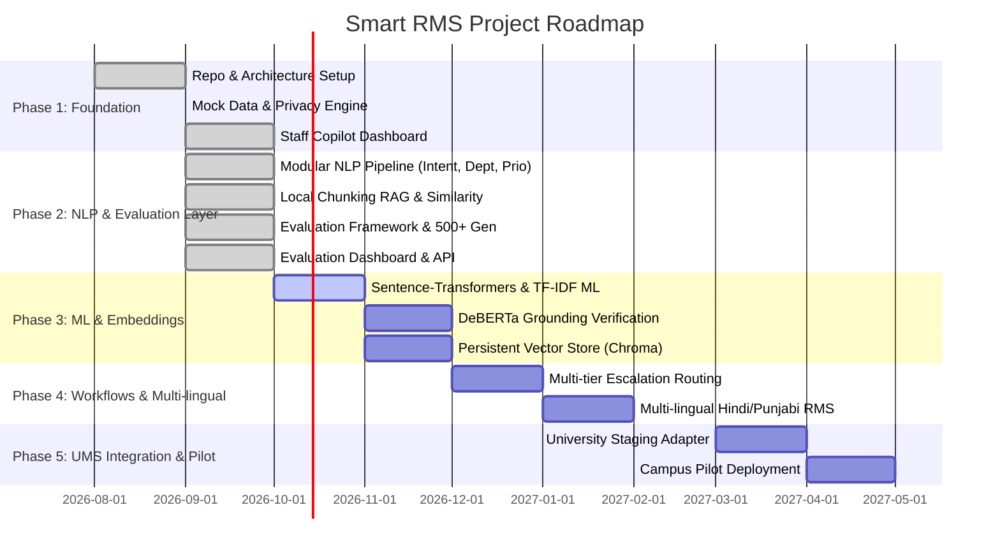

# Product Roadmap: Smart RMS

## Delivery Phases

```mermaid
gantt
    title Smart RMS Project Roadmap
    dateFormat  YYYY-MM
    section Phase 1: Foundation
    Repo & Architecture Setup        :done, p1a, 2026-08, 2026-09
    Mock Data & Privacy Engine       :done, p1b, 2026-09, 2026-09
    Staff Copilot Dashboard          :done, p1c, 2026-09, 2026-10
    section Phase 2: NLP & Evaluation Layer
    Modular NLP Pipeline (Intent, Dept, Prio) :done, p2a, 2026-09, 2026-10
    Local Chunking RAG & Similarity :done, p2b, 2026-09, 2026-10
    Evaluation Framework & 500+ Gen  :done, p2c, 2026-09, 2026-10
    Evaluation Dashboard & API       :done, p2d, 2026-09, 2026-10
    section Phase 3: ML & Embeddings
    Sentence-Transformers & TF-IDF ML :active, p3a, 2026-10, 2026-11
    DeBERTa Grounding Verification   :p3b, 2026-11, 2026-12
    Persistent Vector Store (Chroma) :p3c, 2026-11, 2026-12
    section Phase 4: Workflows & Multi-lingual
    Multi-tier Escalation Routing    :p4a, 2026-12, 2027-01
    Multi-lingual Hindi/Punjabi RMS  :p4b, 2027-01, 2027-02
    section Phase 5: UMS Integration & Pilot
    University Staging Adapter       :p5a, 2027-03, 2027-04
    Campus Pilot Deployment          :p5b, 2027-04, 2027-05
```

---

## Detailed Milestones

### Phase 1: Foundation & Architecture (COMPLETED)
- [x] Full architectural blueprint and documentation suite.
- [x] Standardized synthetic dataset across university departments.
- [x] PII detection and redaction engine for student records.
- [x] Abstract AI and Vector Store providers (`MockAIProvider`, `MockVectorStore`).
- [x] FastAPI REST API with core endpoints (`/health`, `/rms`, `/analyze`, `/draft`, `/approve`).
- [x] Staff Copilot Dashboard (React, TypeScript, Vite, Tailwind).
- [x] University system adapter specification (`MockRMSAdapter`).

### Phase 2: Real NLP & Evaluation Layer (COMPLETED)
- [x] Modular NLP pipeline (`app/nlp/`):
  - Preprocessing and domain tokenization (`preprocessing.py`).
  - Deterministic, testable intent classification (`intent_classifier.py`).
  - Domain-aware department routing engine (`department_classifier.py`).
  - Explainable urgency & priority scoring with signal heuristics (`urgency_classifier.py`).
  - University domain entity extraction without PII leakage (`entity_extractor.py`).
  - Reusable semantic similarity engine with domain canonicalization (`semantic_similarity.py`).
  - Multi-tier confidence and human-in-the-loop review evaluator (`confidence.py`).
- [x] Upgraded RAG retrieval pipeline:
  - Document chunking preserving statutory clauses (`DocumentChunker`).
  - `LocalVectorStore` with TF-IDF/n-gram indexing and metadata filtering.
  - Strict "no-source-no-answer" human review guardrail.
- [x] Comprehensive evaluation framework (`evaluation/`):
  - 60-sample balanced synthetic evaluation dataset with ground truth (`evaluation_rms.json`, `expected_outputs.json`).
  - Runtime computed classification, routing, retrieval, and heuristic grounding metrics.
  - Transparent error analysis documenting misclassifications (`evaluation_report.md`).
- [x] Scale load simulation:
  - 500+ synthetic RMS dataset generator (`scripts/generate_rms_dataset.py`).
  - High-throughput batch analysis service (`scripts/run_batch_analysis.py`).
- [x] Evaluation API (`GET /api/v1/evaluation/summary`) returning dynamically computed metrics.
- [x] Staff Dashboard enhancements:
  - Component-level confidence scores on AI analysis card.
  - Safely tagged domain entity chips.
  - Interactive NLP Evaluation page.
- [x] 27/27 automated backend tests passing; frontend production build verified.

### Phase 3: Classical ML, Transformer Embeddings & Dense Retrieval (Next Milestone)
- Benchmark TF-IDF + Logistic Regression / Naive Bayes / SVM against the current deterministic baseline.
- Local dense vector retrieval using Sentence Transformers (`all-MiniLM-L6-v2`).
- Cross-encoder NLI model for neural claim grounding verification.
- Persistent Chroma / Qdrant vector database containerization.

### Phase 4: Advanced Workflows & Multi-lingual RMS (Q1 2027)
- Multi-tier escalation state machine (Staff → Section Supervisor → HOD → Dean).
- Multi-lingual language support for regional campus queries (Hindi, Punjabi).
- Active learning feedback loop logging staff edits to iteratively refine classification lexicons.

### Phase 5: Campus Staging & Pilot Deployment (Q2 2027)
- Staging adapter testing against approved university sandbox.
- Security audit and penetration review.
- Supervised pilot rollout with Academic Affairs and Hostel Warden offices.
