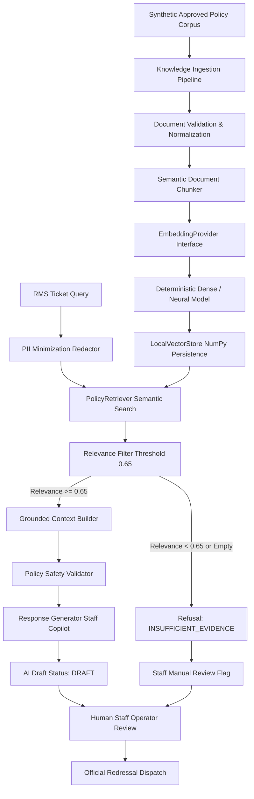

# Grounded RAG Knowledge System Architecture

## 1. System Objective & Core Principle

The Smart RMS Milestone 3 Grounded Retrieval-Augmented Generation (RAG) system provides staff operators with authoritative, grounded university policy evidence.

> **Core Operating Principle:** AI assists. Humans decide.  
> **Core Safety Boundary:** NO AUTHORITATIVE SOURCE &rarr; NO GROUNDED POLICY ANSWER &rarr; MANDATORY HUMAN REVIEW.

The RAG layer does **not** autonomously resolve or dispatch commitments. It retrieves verified synthetic regulations and structures evidence cards for the operator.

---

## 2. End-to-End Pipeline Architecture

---

## 3. Subsystem Breakdown

### 3.1 Policy Corpus & Canonical Contracts
All documents adhere to the canonical `KnowledgeDocument` schema:
- **`document_id`**: Stable semantic identifier (e.g. `DOC-ACAD-001`, `DOC-EXAM-001`).
- **`version`**: Semantic versioning (`2.0`, `1.0`). Superseded versions are automatically excluded from production retrieval.
- **`approval_status`**: Only `APPROVED` documents are indexed. `DRAFT` and `SUPERSEDED` records are filtered out.
- **`effective_date` / `expiry_date`**: Verified against current UTC timestamps. Expired policies are filtered.

### 3.2 Ingestion & Semantic Chunking
Document text is chunked according to semantic boundaries (clauses, sections, and paragraphs) rather than arbitrary character splits. Each `KnowledgeChunk` carries full provenance metadata:
- `chunk_id`: `DOC-ACAD-001-V20-S1-C1`
- `document_id`: `DOC-ACAD-001`
- `document_title`: Full policy title
- `clause`: Statutory clause reference
- `department`: Owning operational department

### 3.3 Modular Embedding Abstraction
The system provides a provider-independent `EmbeddingProvider` interface:
- **`DeterministicLocalEmbeddingProvider`**: 384-dimensional dense projection combining token-level SHA-256 sign hashing, sub-word character 3-gram hashing, domain synonym mapping, and L2 unit normalization. Guarantees deterministic, sub-millisecond execution in offline and CI environments.
- **`SentenceTransformerEmbeddingProvider`**: Modular neural integration supporting `all-MiniLM-L6-v2`.

### 3.4 Local Vector Store
Backed by `LocalVectorStore` using in-memory NumPy dot-products over normalized embeddings:
- Sub-millisecond similarity scoring.
- Statutorily constrained metadata filtering (approval status, active date windows, version precedence).
- Soft departmental prioritization (+18% score calibration) ensuring department relevancy without blinding cross-department regulations.
- Persistence to `data/mock/knowledge_index.json`.

### 3.5 Context Builder & Safety Refusal Boundary
`RAGContextBuilder` receives the query, retrieves candidates, and applies the configurable relevance threshold (`0.65` baseline):
- **When authoritative evidence is retrieved (&ge; 0.65)**: Generates `GroundedContext` with `grounding_status="GROUNDED"` and formatted citation blocks.
- **When no candidate meets threshold**: Emits `grounding_status="INSUFFICIENT_EVIDENCE"`, sets `needs_human_review=True`, and blocks automated policy generation.

### 3.6 Human-in-the-Loop Staff Review
Every AI response is tagged `AI_DRAFT` with status `DRAFT`. The frontend displays:
- Citation badges with exact clause references.
- Match percentage indicators.
- Source excerpt drawers.
- Strict requirement for staff approval before external dispatch.
